# Plan chi tiết: Web App Ecommerce Marketplace (MVP)

## 1. Tổng quan sản phẩm

**Mục tiêu MVP:** Người mua duyệt sản phẩm từ nhiều seller, thêm giỏ hàng, thanh toán, theo dõi đơn; seller quản lý shop/sản phẩm/đơn; admin platform duyệt seller và giám sát hệ thống.

**Không nằm trong MVP (phase sau):** Reviews, wishlist, coupon nâng cao, loyalty, multi-warehouse, chat seller-buyer, recommendation AI.

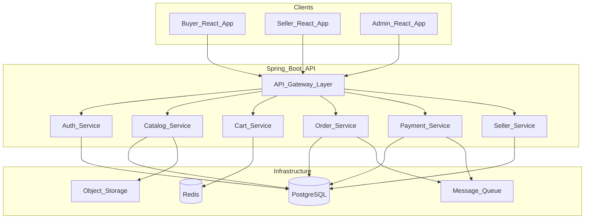
```mermaid
flowchart TB
  subgraph clients [Clients]
    BuyerApp[Buyer_React_App]
    SellerApp[Seller_React_App]
    AdminApp[Admin_React_App]
  end

  subgraph backend [Spring_Boot_API]
    Gateway[API_Gateway_Layer]
    AuthSvc[Auth_Service]
    CatalogSvc[Catalog_Service]
    CartSvc[Cart_Service]
    OrderSvc[Order_Service]
    PaymentSvc[Payment_Service]
    SellerSvc[Seller_Service]
  end

  subgraph infra [Infrastructure]
  DB[(PostgreSQL)]
  Redis[(Redis)]
  S3[Object_Storage]
  Queue[Message_Queue]
  end

  BuyerApp --> Gateway
  SellerApp --> Gateway
  AdminApp --> Gateway
  Gateway --> AuthSvc
  Gateway --> CatalogSvc
  Gateway --> CartSvc
  Gateway --> OrderSvc
  Gateway --> PaymentSvc
  Gateway --> SellerSvc
  AuthSvc --> DB
  CatalogSvc --> DB
  CartSvc --> Redis
  OrderSvc --> DB
  PaymentSvc --> DB
  SellerSvc --> DB
  CatalogSvc --> S3
  OrderSvc --> Queue
  PaymentSvc --> Queue
```


---

## 2. Kiến trúc kỹ thuật

### Backend — Spring Boot (monolith modular cho MVP)


| Layer     | Công nghệ                                            |
| --------- | ---------------------------------------------------- |
| Framework | Spring Boot 3.x, Java 21                             |
| API       | REST + OpenAPI (Springdoc)                           |
| Security  | Spring Security + JWT (access) + refresh token       |
| DB        | PostgreSQL 16                                        |
| Cache     | Redis (session cart, rate limit)                     |
| ORM       | Spring Data JPA + Flyway migrations                  |
| File      | AWS S3 / MinIO (ảnh sản phẩm)                        |
| Async     | Spring Events hoặc RabbitMQ (email, webhook payment) |
| Search    | PostgreSQL full-text (MVP); Elasticsearch (phase 2)  |


**Cấu trúc package đề xuất:**

```
backend/
  src/main/java/com/marketplace/
    config/          # Security, CORS, Redis
    auth/            # Login, register, JWT
    user/            # User profile, addresses
    seller/          # Shop, KYC, seller dashboard
    catalog/         # Category, product, variant, inventory
    cart/            # Cart, cart items
    order/           # Checkout, order, order items, status
    payment/         # Stripe, VNPay, Momo adapters
    shipping/        # Rate calc, carrier integration
    admin/           # Platform moderation
    common/          # DTO, exception, util
```

### Frontend — React


| Layer     | Công nghệ                                   |
| --------- | ------------------------------------------- |
| Framework | React 18 + TypeScript                       |
| Build     | Vite                                        |
| Routing   | React Router v6                             |
| State     | TanStack Query (server) + Zustand (cart UI) |
| UI        | Tailwind CSS + shadcn/ui                    |
| Forms     | React Hook Form + Zod                       |
| i18n      | react-i18next (vi/en)                       |
| Payment   | Stripe.js (global), redirect VNPay/Momo     |


**3 app shell (có thể 1 repo monorepo):**

```
frontend/
  apps/
    buyer/       # Trang mua hàng công khai
    seller/      # Portal seller (protected)
    admin/       # Portal admin (protected)
  packages/
    ui/          # Shared components
    api-client/  # Generated từ OpenAPI
    types/       # Shared TypeScript types
```

---

## 3. Vai trò người dùng & quyền

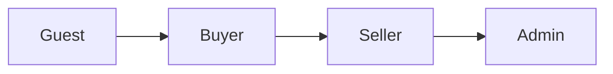
```mermaid
flowchart LR
  Guest --> Buyer
  Buyer --> Seller
  Seller --> Admin
```


| Role       | Quyền chính                                                    |
| ---------- | -------------------------------------------------------------- |
| **Guest**  | Xem catalog, search, xem chi tiết SP                           |
| **Buyer**  | Giỏ hàng, checkout, đơn hàng, địa chỉ, profile                 |
| **Seller** | CRUD sản phẩm shop mình, xem/fulfill đơn của shop              |
| **Admin**  | Duyệt seller, suspend shop, xem toàn bộ đơn, cấu hình category |


**Lưu ý marketplace:** Một user có thể vừa là Buyer vừa là Seller (role kép).

---

## 4. Danh mục chức năng chi tiết

### 4.1 Ma trận chức năng theo module


| Module               | Chức năng                                   | Actor       | MVP       |
| -------------------- | ------------------------------------------- | ----------- | --------- |
| **Auth**             | Đăng ký email/password                      | Guest       | Yes       |
|                      | Đăng nhập / đăng xuất                       | All         | Yes       |
|                      | Refresh token                               | All         | Yes       |
|                      | Quên mật khẩu (email reset)                 | Guest       | Yes       |
|                      | Gán role BUYER / SELLER                     | User        | Yes       |
| **Profile**          | Xem/sửa thông tin cá nhân                   | Buyer       | Yes       |
|                      | Quản lý sổ địa chỉ (CRUD, đặt mặc định)     | Buyer       | Yes       |
| **Catalog (public)** | Duyệt danh mục dạng cây                     | Guest       | Yes       |
|                      | Listing sản phẩm (filter, sort, pagination) | Guest       | Yes       |
|                      | Tìm kiếm full-text theo tên/mô tả           | Guest       | Yes       |
|                      | Chi tiết sản phẩm + chọn variant            | Guest       | Yes       |
|                      | Xem trang shop seller (public)              | Guest       | Yes       |
| **Cart**             | Thêm/sửa/xóa item trong giỏ                 | Buyer       | Yes       |
|                      | Giỏ guest (session) merge khi login         | Guest→Buyer | Yes       |
|                      | Kiểm tra tồn kho realtime                   | Buyer       | Yes       |
|                      | Validate không trộn currency                | Buyer       | Yes       |
| **Checkout**         | Chọn địa chỉ giao hàng                      | Buyer       | Yes       |
|                      | Tính phí ship theo vùng (flat rate)         | Buyer       | Yes       |
|                      | Tóm tắt đơn tách theo seller                | Buyer       | Yes       |
|                      | Chọn phương thức thanh toán                 | Buyer       | Yes       |
| **Order**            | Tạo đơn + order_groups                      | System      | Yes       |
|                      | Lịch sử đơn hàng                            | Buyer       | Yes       |
|                      | Chi tiết đơn (tổng + từng seller group)     | Buyer       | Yes       |
|                      | Hủy đơn (trước khi ship, rule giới hạn)     | Buyer       | Phase 1.5 |
| **Payment**          | Stripe (card, USD/EUR)                      | Buyer       | Yes       |
|                      | VNPay redirect (VND)                        | Buyer       | Yes       |
|                      | Momo redirect (VND)                         | Buyer       | Yes       |
|                      | COD — xác nhận thu tiền khi giao            | Buyer       | Yes       |
|                      | Webhook xử lý idempotent                    | System      | Yes       |
| **Shipping**         | Seller nhập tracking number                 | Seller      | Yes       |
|                      | Buyer xem trạng thái vận chuyển             | Buyer       | Yes       |
|                      | Rate quote API (FedEx/UPS/USPS)             | System      | Phase 2   |
| **Seller**           | Đăng ký mở shop                             | Buyer       | Yes       |
|                      | Dashboard (đơn mới, doanh thu)              | Seller      | Yes       |
|                      | CRUD sản phẩm + variant + inventory         | Seller      | Yes       |
|                      | Upload ảnh sản phẩm                         | Seller      | Yes       |
|                      | Quản lý đơn hàng của shop                   | Seller      | Yes       |
|                      | Cập nhật trạng thái fulfill                 | Seller      | Yes       |
| **Admin**            | Duyệt/từ chối/suspend seller                | Admin       | Yes       |
|                      | Moderation sản phẩm (optional)              | Admin       | Optional  |
|                      | CRUD danh mục toàn platform                 | Admin       | Yes       |
|                      | Xem tất cả đơn hàng                         | Admin       | Yes       |
|                      | Tìm kiếm user/seller                        | Admin       | Yes       |
|                      | Audit log hành động admin                   | Admin       | Yes       |
| **Notification**     | Email xác nhận đơn                          | System      | Yes       |
|                      | Email seller có đơn mới                     | System      | Yes       |
|                      | Email duyệt/từ chối shop                    | System      | Yes       |


### 4.2 Phân rã chức năng theo portal

**Buyer portal**

- Trang chủ: banner, danh mục nổi bật, sản phẩm mới
- PLP (Product Listing Page): filter theo category, giá, seller; sort theo giá/mới nhất
- PDP (Product Detail Page): gallery ảnh, variant picker, stock indicator, nút "Thêm giỏ"
- Cart: nhóm item theo seller, hiển thị subtotal từng shop
- Checkout 3 bước: (1) địa chỉ → (2) shipping + review → (3) payment
- Account: profile, addresses, orders

**Seller portal**

- Onboarding wizard: thông tin shop → submit → chờ duyệt
- Product manager: list/draft/create/edit, bulk status change
- Order inbox: tab New / Processing / Shipped / Completed
- Fulfillment: confirm → pack → nhập tracking → mark shipped

**Admin portal**

- Seller queue: pending applications với approve/reject + lý do
- Order monitor: search by order ID, buyer email, seller
- Category tree editor: drag-drop (optional) hoặc form parent/child
- System overview: tổng đơn, seller active, GMV đơn giản

---

## 5. Use cases chi tiết

Quy ước: **UC-[Actor]-[ID]** | Priority: P0 = bắt buộc MVP, P1 = nên có, P2 = phase sau

### 5.1 Guest / Buyer


| ID         | Tên                                   | Actor       | Priority |
| ---------- | ------------------------------------- | ----------- | -------- |
| UC-GST-001 | Duyệt danh mục sản phẩm               | Guest       | P0       |
| UC-GST-002 | Tìm kiếm sản phẩm                     | Guest       | P0       |
| UC-GST-003 | Xem chi tiết sản phẩm và variant      | Guest       | P0       |
| UC-BUY-001 | Đăng ký tài khoản                     | Guest       | P0       |
| UC-BUY-002 | Đăng nhập / đăng xuất                 | Buyer       | P0       |
| UC-BUY-003 | Quên mật khẩu                         | Guest       | P0       |
| UC-BUY-004 | Quản lý profile và địa chỉ            | Buyer       | P0       |
| UC-BUY-005 | Thêm sản phẩm vào giỏ hàng            | Buyer/Guest | P0       |
| UC-BUY-006 | Cập nhật/xóa item trong giỏ           | Buyer       | P0       |
| UC-BUY-007 | Merge giỏ guest sau khi login         | Buyer       | P0       |
| UC-BUY-008 | Checkout đa seller                    | Buyer       | P0       |
| UC-BUY-009 | Thanh toán online (Stripe/VNPay/Momo) | Buyer       | P0       |
| UC-BUY-010 | Thanh toán COD                        | Buyer       | P0       |
| UC-BUY-011 | Xem lịch sử và chi tiết đơn hàng      | Buyer       | P0       |
| UC-BUY-012 | Theo dõi trạng thái vận chuyển        | Buyer       | P0       |
| UC-BUY-013 | Hủy đơn (trước processing)            | Buyer       | P1       |
| UC-BUY-014 | Đăng ký mở shop (seller onboarding)   | Buyer       | P0       |


#### UC-BUY-005 — Thêm sản phẩm vào giỏ hàng

- **Mô tả:** Buyer chọn variant và số lượng, thêm vào giỏ.
- **Tiền điều kiện:** Sản phẩm `active`; variant còn hàng; seller `approved`.
- **Luồng chính:**
  1. Buyer chọn variant (size/color) và quantity trên PDP
  2. Hệ thống kiểm tra `available_qty = quantity - reserved_qty >= requested`
  3. Nếu giỏ đã có item khác currency → từ chối, báo lỗi
  4. Thêm/update cart_item; tăng `reserved_qty` (TTL 30 phút)
  5. Trả về cart summary cập nhật
- **Luồng thay thế:**
  - 2a. Hết hàng → hiển thị "Hết hàng", không thêm
  - 3a. Khác currency → "Giỏ hàng chỉ hỗ trợ một loại tiền tệ"
- **Hậu điều kiện:** Cart có item mới; inventory reserved tạm thời

#### UC-BUY-008 — Checkout đa seller

- **Mô tả:** Buyer thanh toán một lần cho giỏ có sản phẩm từ nhiều seller.
- **Tiền điều kiện:** Đã login; giỏ không rỗng; tất cả item còn đủ stock.
- **Luồng chính:**
  1. Buyer vào checkout, chọn địa chỉ giao hàng
  2. Hệ thống nhóm cart_items theo `seller_id`
  3. Tính `shipping_fee` riêng cho từng seller group theo vùng địa chỉ
  4. Hiển thị breakdown: subtotal/seller + ship + grand total
  5. Buyer chọn payment method
  6. `POST /checkout` → tạo `order` + N `order_groups` + `payment` record
  7. Chuyển sang luồng thanh toán tương ứng
- **Luồng thay thế:**
  - 1a. Chưa có địa chỉ → bắt buộc tạo địa chỉ mới
  - 6a. Stock thay đổi → rollback, báo item nào hết hàng
- **Hậu điều kiện:** Order ở trạng thái `pending_payment`; inventory hard-lock

#### UC-BUY-009 — Thanh toán online

- **Tiền điều kiện:** Order `pending_payment`; chưa quá timeout (15 phút)
- **Luồng chính (Stripe):**
  1. Backend tạo Stripe PaymentIntent với `amount`, `currency`, `metadata.orderId`
  2. Frontend hiển thị Stripe Elements
  3. Buyer nhập card → confirm
  4. Stripe gửi webhook `payment_intent.succeeded`
  5. Backend verify signature → cập nhật `payment=success`, `order=paid`
  6. Trừ inventory thật; gửi email xác nhận; notify seller
- **Luồng chính (VNPay/Momo):**
  1. Backend tạo payment URL với order reference
  2. Redirect buyer sang cổng thanh toán
  3. Buyer thanh toán → callback IPN/webhook
  4. Backend verify checksum → cập nhật trạng thái tương tự bước 5–6 Stripe
- **Luồng thay thế:**
  - 4a/3a. Thanh toán fail → `payment=failed`, release inventory sau grace period
  - 4b. Webhook trễ → reconciliation job quét trạng thái từ provider

#### UC-BUY-010 — Thanh toán COD

- **Luồng chính:**
  1. Buyer chọn COD tại checkout
  2. Order chuyển `payment_status=awaiting_cod`, `status=confirmed`
  3. Seller fulfill bình thường
  4. Khi giao hàng thành công, seller/admin mark `payment=captured`
- **Ràng buộc MVP:** Chỉ áp dụng địa chỉ VN; có thể giới hạn `order.total` tối đa (vd. 10M VND)

### 5.2 Seller


| ID         | Tên                                   | Actor         | Priority |
| ---------- | ------------------------------------- | ------------- | -------- |
| UC-SEL-001 | Đăng ký mở shop                       | Buyer         | P0       |
| UC-SEL-002 | Cập nhật thông tin shop               | Seller        | P0       |
| UC-SEL-003 | Tạo sản phẩm (draft)                  | Seller        | P0       |
| UC-SEL-004 | Publish sản phẩm lên marketplace      | Seller        | P0       |
| UC-SEL-005 | Quản lý variant và tồn kho            | Seller        | P0       |
| UC-SEL-006 | Upload/xóa ảnh sản phẩm               | Seller        | P0       |
| UC-SEL-007 | Nhận thông báo đơn mới                | Seller        | P0       |
| UC-SEL-008 | Xác nhận và xử lý đơn                 | Seller        | P0       |
| UC-SEL-009 | Nhập tracking và mark shipped         | Seller        | P0       |
| UC-SEL-010 | Mark delivered (hoặc auto sau N ngày) | Seller/System | P1       |


#### UC-SEL-001 — Đăng ký mở shop

- **Tiền điều kiện:** User đã login; chưa có seller profile hoặc profile bị rejected
- **Luồng chính:**
  1. Buyer chọn "Trở thành người bán"
  2. Điền: tên shop, mô tả, loại hình (cá nhân/doanh nghiệp), SĐT, địa chỉ kho
  3. Upload giấy tờ (CMND/GPKD) — MVP: 1–2 file
  4. Submit → `seller_profile.status = pending`
  5. Gửi email "Đang chờ duyệt"
- **Hậu điều kiện:** Seller chưa được phép listing sản phẩm cho đến khi approved

#### UC-SEL-008 — Xác nhận và xử lý đơn

- **Tiền điều kiện:** `order_group.status = paid` (hoặc `confirmed` với COD); thuộc shop của seller
- **Luồng chính:**
  1. Seller mở order inbox, thấy đơn mới
  2. Xem chi tiết: items, địa chỉ giao (masked phone nếu cần), ghi chú buyer
  3. Seller bấm "Xác nhận" → `order_group.status = processing`
  4. Đóng gói hàng
  5. Chuyển sang UC-SEL-009 (shipped)
- **Luồng thay thế:**
2a. Hết hàng sau khi đặt → seller liên hệ buyer/admin; admin có thể cancel partial (P1)

#### UC-SEL-009 — Nhập tracking và mark shipped

- **Luồng chính:**
  1. Seller chọn carrier (GHN, GHTK, FedEx, Other)
  2. Nhập `tracking_number`
  3. Submit → tạo `shipment` record; `order_group.status = shipped`
  4. Gửi email cho buyer kèm link tracking (nếu carrier hỗ trợ)

### 5.3 Admin


| ID         | Tên                                | Actor | Priority |
| ---------- | ---------------------------------- | ----- | -------- |
| UC-ADM-001 | Duyệt đơn đăng ký seller           | Admin | P0       |
| UC-ADM-002 | Suspend / reactivate seller        | Admin | P0       |
| UC-ADM-003 | Quản lý cây danh mục               | Admin | P0       |
| UC-ADM-004 | Moderation sản phẩm vi phạm        | Admin | P1       |
| UC-ADM-005 | Tra cứu đơn hàng toàn platform     | Admin | P0       |
| UC-ADM-006 | Can thiệp trạng thái đơn (dispute) | Admin | P1       |
| UC-ADM-007 | Xem audit log                      | Admin | P0       |


#### UC-ADM-001 — Duyệt seller

- **Luồng chính:**
  1. Admin mở queue `status=pending`
  2. Xem hồ sơ shop + tài liệu đính kèm
  3. Approve → `status=approved`, gán role SELLER cho user, email thông báo
  4. Hoặc Reject → nhập lý do, `status=rejected`, email thông báo
- **Hậu điều kiện:** Seller approved có thể tạo và publish sản phẩm

### 5.4 System (tự động)


| ID         | Tên                                        | Trigger                 | Priority |
| ---------- | ------------------------------------------ | ----------------------- | -------- |
| UC-SYS-001 | Release inventory reservation hết hạn      | Cron mỗi 5 phút         | P0       |
| UC-SYS-002 | Hủy order payment timeout                  | Order pending > 15 phút | P0       |
| UC-SYS-003 | Payment reconciliation                     | Cron mỗi 15 phút        | P0       |
| UC-SYS-004 | Gửi email notification                     | Order/payment events    | P0       |
| UC-SYS-005 | Auto complete order sau delivered + 7 ngày | Cron daily              | P1       |


---

## 6. Luồng nghiệp vụ chi tiết

### 6.1 State machine — Order (cấp buyer)

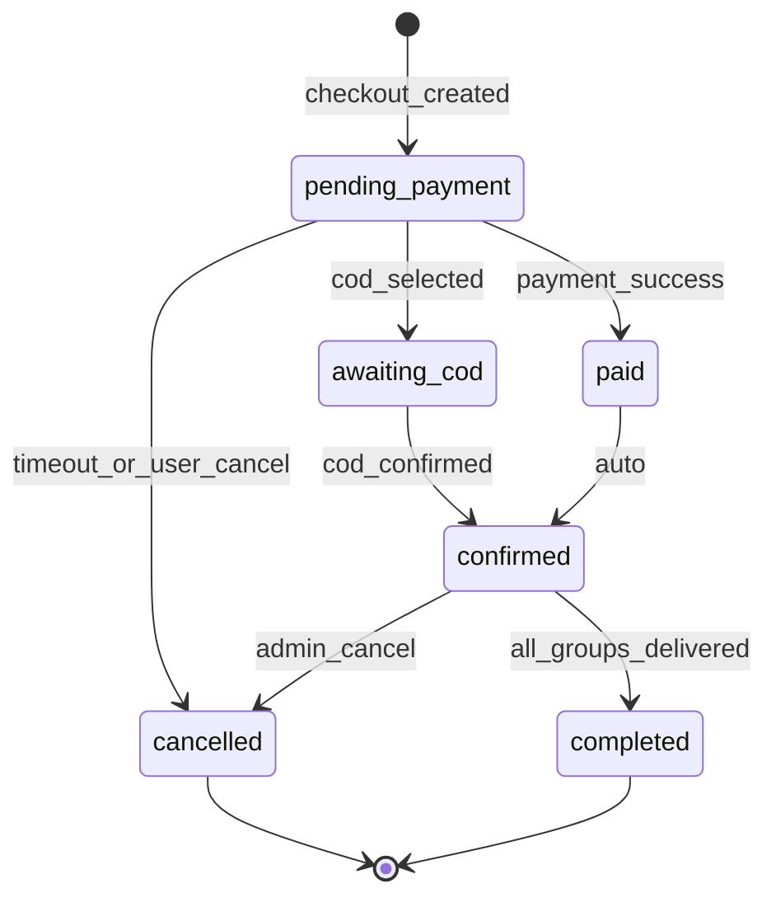
```mermaid
stateDiagram-v2
  [*] --> pending_payment: checkout_created
  pending_payment --> paid: payment_success
  pending_payment --> cancelled: timeout_or_user_cancel
  pending_payment --> awaiting_cod: cod_selected
  awaiting_cod --> confirmed: cod_confirmed
  paid --> confirmed: auto
  confirmed --> completed: all_groups_delivered
  confirmed --> cancelled: admin_cancel
  cancelled --> [*]
  completed --> [*]
```


| Trạng thái        | Ý nghĩa                           | Ai thấy       |
| ----------------- | --------------------------------- | ------------- |
| `pending_payment` | Đã tạo đơn, chờ thanh toán online | Buyer         |
| `awaiting_cod`    | COD, chờ giao hàng thu tiền       | Buyer, Seller |
| `paid`            | Thanh toán online thành công      | All           |
| `confirmed`       | Đơn hợp lệ, seller bắt đầu xử lý  | All           |
| `completed`       | Tất cả seller groups đã delivered | Buyer         |
| `cancelled`       | Đã hủy                            | All           |


### 6.2 State machine — OrderGroup (cấp seller)

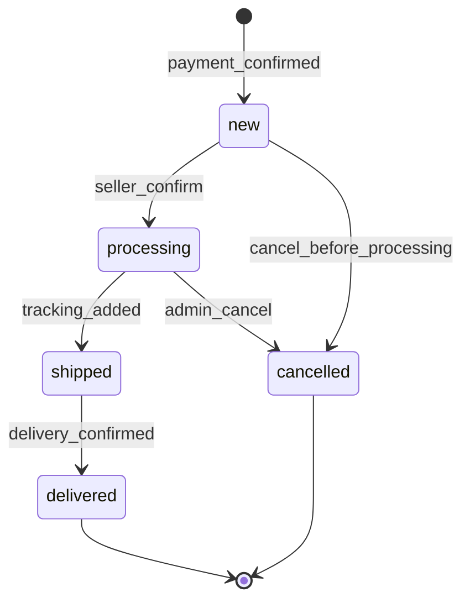
```mermaid
stateDiagram-v2
  [*] --> new: payment_confirmed
  new --> processing: seller_confirm
  processing --> shipped: tracking_added
  shipped --> delivered: delivery_confirmed
  new --> cancelled: cancel_before_processing
  processing --> cancelled: admin_cancel
  delivered --> [*]
  cancelled --> [*]
```


Mỗi seller chỉ điều khiển group của mình. Order cha `completed` khi **tất cả** groups = `delivered` hoặc `cancelled` (với refund logic P1).

### 6.3 State machine — SellerProfile

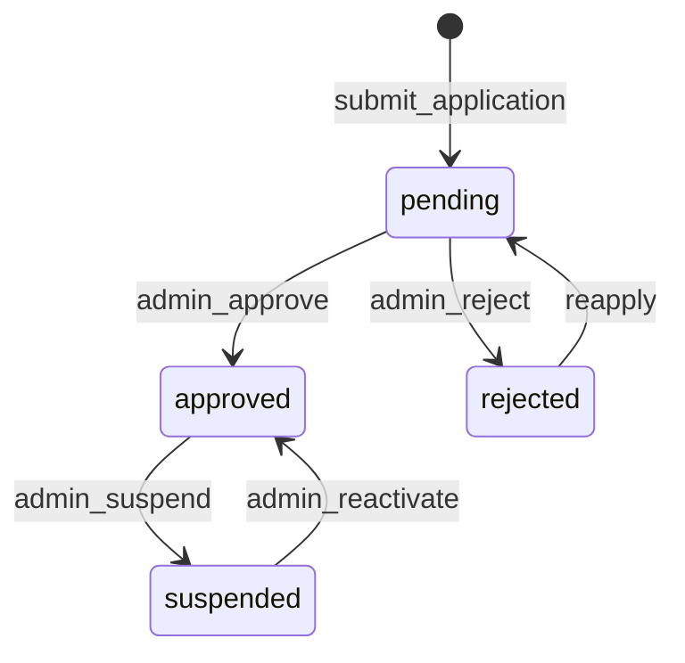
```mermaid
stateDiagram-v2
  [*] --> pending: submit_application
  pending --> approved: admin_approve
  pending --> rejected: admin_reject
  rejected --> pending: reapply
  approved --> suspended: admin_suspend
  suspended --> approved: admin_reactivate
```


Khi `suspended`: sản phẩm ẩn khỏi catalog; đơn đang xử lý vẫn fulfill.

### 6.4 State machine — Product

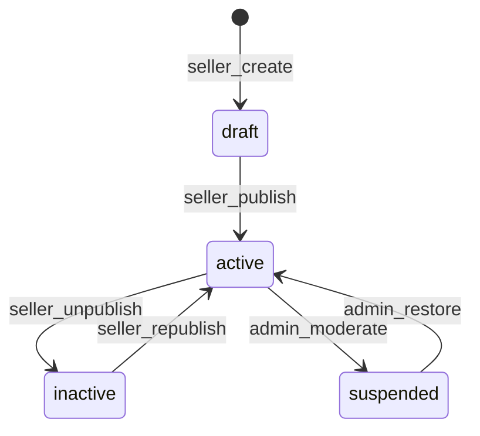
```mermaid
stateDiagram-v2
  [*] --> draft: seller_create
  draft --> active: seller_publish
  active --> inactive: seller_unpublish
  inactive --> active: seller_republish
  active --> suspended: admin_moderate
  suspended --> active: admin_restore
```


MVP: có thể bỏ bước `pending` moderation; admin `suspended` khi vi phạm.

### 6.5 Luồng đăng ký & xác thực

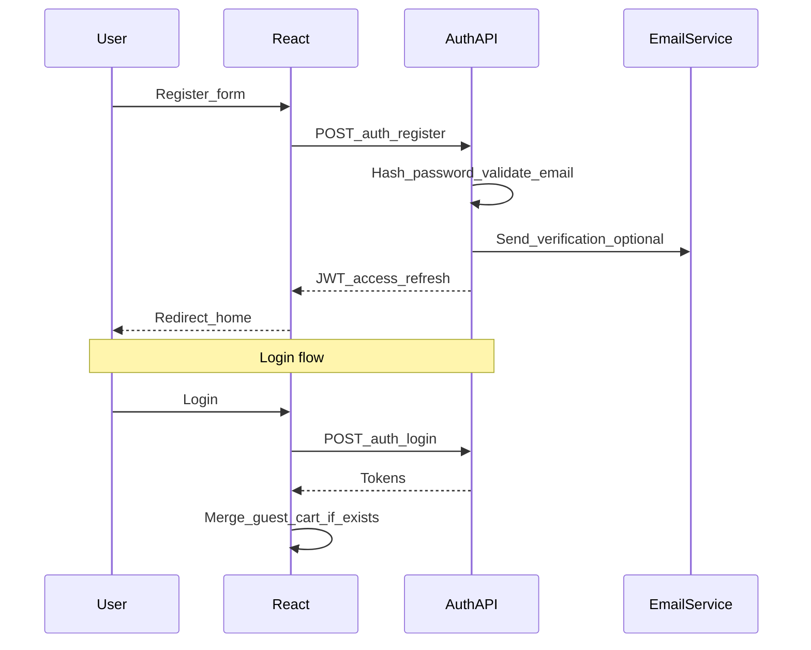
```mermaid
sequenceDiagram
  participant U as User
  participant FE as React
  participant API as AuthAPI
  participant Mail as EmailService

  U->>FE: Register_form
  FE->>API: POST_auth_register
  API->>API: Hash_password_validate_email
  API->>Mail: Send_verification_optional
  API-->>FE: JWT_access_refresh
  FE-->>U: Redirect_home

  Note over U,API: Login flow
  U->>FE: Login
  FE->>API: POST_auth_login
  API-->>FE: Tokens
  FE->>FE: Merge_guest_cart_if_exists
```


**Quy tắc MVP:**

- Email unique; password min 8 ký tự
- Access token TTL 15 phút; refresh 7 ngày
- Guest cart lưu Redis key `cart:guest:{sessionId}` → merge vào `cart:user:{userId}` khi login

### 6.6 Luồng seller onboarding → bán hàng

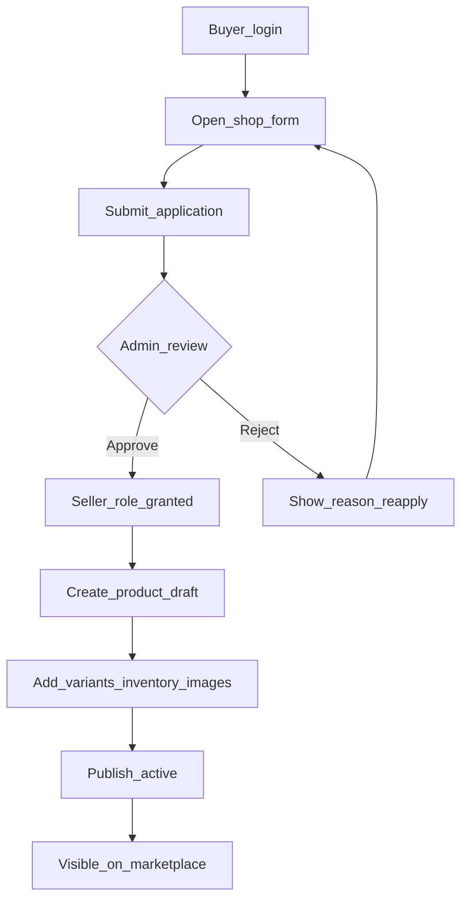
```mermaid
flowchart TD
  A[Buyer_login] --> B[Open_shop_form]
  B --> C[Submit_application]
  C --> D{Admin_review}
  D -->|Approve| E[Seller_role_granted]
  D -->|Reject| F[Show_reason_reapply]
  E --> G[Create_product_draft]
  G --> H[Add_variants_inventory_images]
  H --> I[Publish_active]
  I --> J[Visible_on_marketplace]
  F --> B
```


### 6.7 Luồng inventory reservation

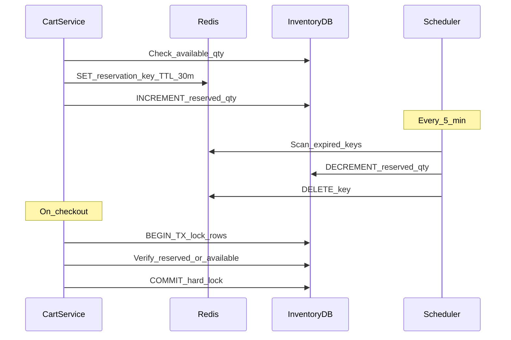
```mermaid
sequenceDiagram
  participant C as CartService
  participant R as Redis
  participant DB as InventoryDB
  participant Job as Scheduler

  C->>DB: Check_available_qty
  C->>R: SET_reservation_key_TTL_30m
  C->>DB: INCREMENT_reserved_qty

  Note over Job: Every_5_min
  Job->>R: Scan_expired_keys
  Job->>DB: DECREMENT_reserved_qty
  Job->>R: DELETE_key

  Note over C: On_checkout
  C->>DB: BEGIN_TX_lock_rows
  C->>DB: Verify_reserved_or_available
  C->>DB: COMMIT_hard_lock
```


### 6.8 Luồng checkout & payment end-to-end

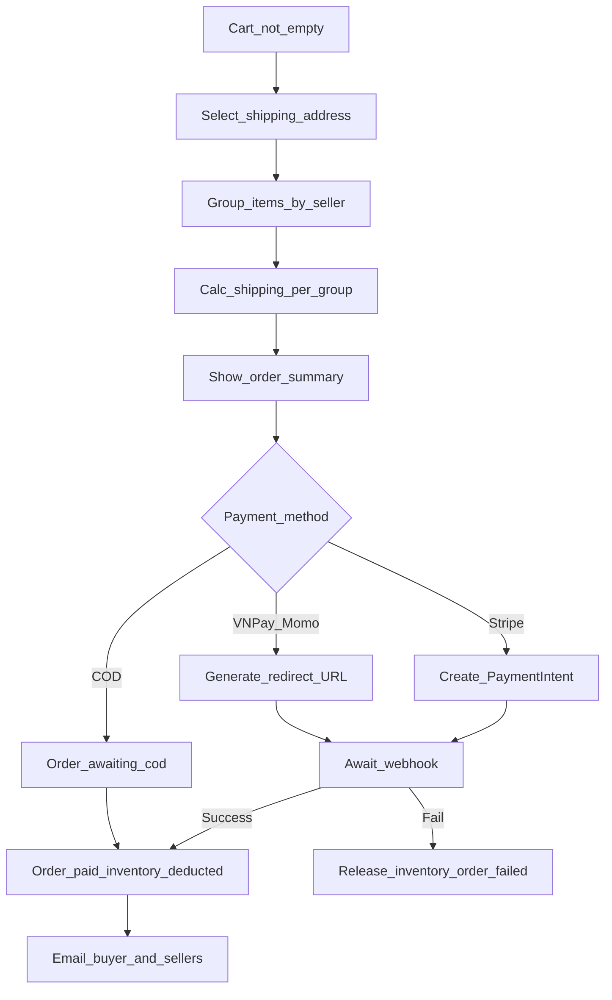
```mermaid
flowchart TD
  start[Cart_not_empty] --> addr[Select_shipping_address]
  addr --> split[Group_items_by_seller]
  split --> ship[Calc_shipping_per_group]
  ship --> review[Show_order_summary]
  review --> payMethod{Payment_method}
  payMethod -->|Stripe| stripe[Create_PaymentIntent]
  payMethod -->|VNPay_Momo| redirect[Generate_redirect_URL]
  payMethod -->|COD| cod[Order_awaiting_cod]
  stripe --> waitWebhook[Await_webhook]
  redirect --> waitWebhook
  waitWebhook -->|Success| confirm[Order_paid_inventory_deducted]
  waitWebhook -->|Fail| fail[Release_inventory_order_failed]
  cod --> confirm
  confirm --> notify[Email_buyer_and_sellers]
```


**Chi tiết tính phí ship (MVP flat rate):**


| Vùng               | VN seller  | Global seller |
| ------------------ | ---------- | ------------- |
| Nội thành HN/HCM   | 30,000 VND | —             |
| Tỉnh/thành khác VN | 50,000 VND | —             |
| US domestic        | —          | $5 flat       |
| International      | —          | $15 flat      |


Mỗi `order_group` chịu một lần phí ship (không tính theo từng item).

### 6.9 Luồng fulfillment (seller → buyer)

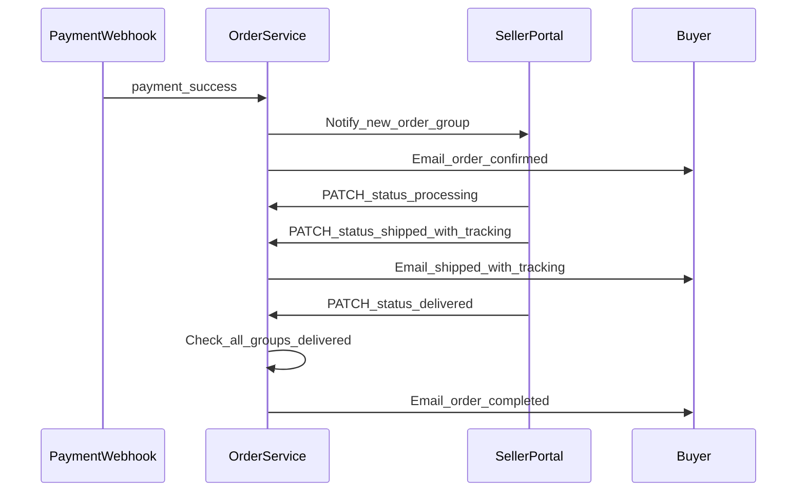
```mermaid
sequenceDiagram
  participant Pay as PaymentWebhook
  participant O as OrderService
  participant S as SellerPortal
  participant B as Buyer

  Pay->>O: payment_success
  O->>S: Notify_new_order_group
  O->>B: Email_order_confirmed
  S->>O: PATCH_status_processing
  S->>O: PATCH_status_shipped_with_tracking
  O->>B: Email_shipped_with_tracking
  S->>O: PATCH_status_delivered
  O->>O: Check_all_groups_delivered
  O->>B: Email_order_completed
```


### 6.10 Luồng xử lý lỗi & edge cases


| Tình huống                           | Hành vi hệ thống                                   |
| ------------------------------------ | -------------------------------------------------- |
| Buyer thêm SP seller bị suspend      | Ẩn SP; cart item invalid → báo lỗi khi vào giỏ     |
| Payment webhook đến 2 lần            | Idempotent key `payment.external_id`; bỏ qua lần 2 |
| Checkout khi reservation hết hạn     | Re-validate stock; fail nếu không đủ               |
| 1 seller group cancelled, còn lại OK | Order vẫn `confirmed`; partial refund P1           |
| Buyer đổi địa chỉ sau checkout       | Không cho phép (MVP); phải cancel và đặt lại       |
| Mix VND + USD trong giỏ              | Block ở add-to-cart và checkout                    |
| Seller không ship trong 72h          | Email nhắc; admin alert (P1)                       |


### 6.11 Sơ đồ tương tác tổng thể (happy path)

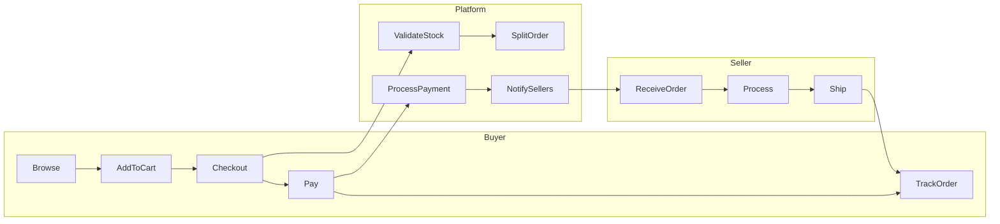
```mermaid
flowchart LR
  subgraph buyerFlow [Buyer]
    B1[Browse] --> B2[AddToCart]
    B2 --> B3[Checkout]
    B3 --> B4[Pay]
    B4 --> B5[TrackOrder]
  end

  subgraph platformFlow [Platform]
    P1[ValidateStock]
    P2[SplitOrder]
    P3[ProcessPayment]
    P4[NotifySellers]
  end

  subgraph sellerFlow [Seller]
    S1[ReceiveOrder]
    S2[Process]
    S3[Ship]
  end

  B3 --> P1 --> P2
  B4 --> P3 --> P4 --> S1
  S1 --> S2 --> S3 --> B5
```


---

## 7. Data model cốt lõi (ERD rút gọn)

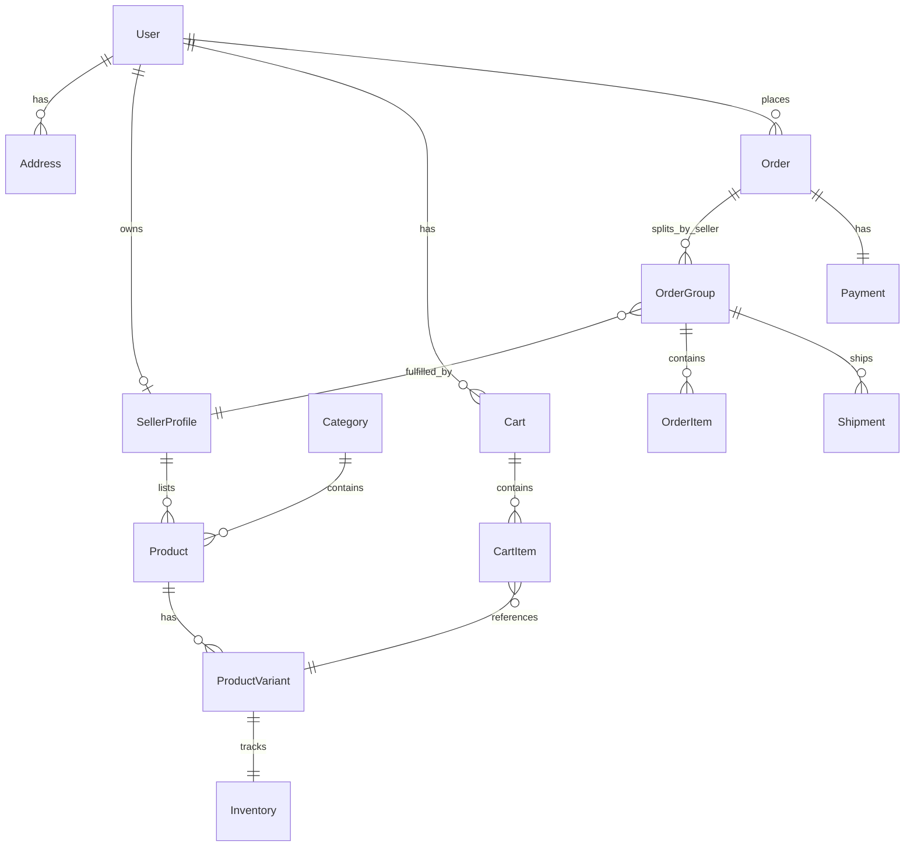
```mermaid
erDiagram
  User ||--o{ Address : has
  User ||--o| SellerProfile : owns
  SellerProfile ||--o{ Product : lists
  Category ||--o{ Product : contains
  Product ||--o{ ProductVariant : has
  ProductVariant ||--|| Inventory : tracks
  User ||--o{ Cart : has
  Cart ||--o{ CartItem : contains
  CartItem }o--|| ProductVariant : references
  User ||--o{ Order : places
  Order ||--o{ OrderGroup : splits_by_seller
  OrderGroup }o--|| SellerProfile : fulfilled_by
  OrderGroup ||--o{ OrderItem : contains
  Order ||--|| Payment : has
  OrderGroup ||--o{ Shipment : ships
```


### Bảng quan trọng

- **users** — email, password_hash, roles[], status
- **seller_profiles** — shop_name, slug, status (pending/approved/suspended), commission_rate
- **categories** — tree structure (parent_id)
- **products** — seller_id, category_id, name, description, status (draft/pending/active)
- **product_variants** — sku, price, compare_at_price, attributes (JSON: size, color)
- **inventory** — variant_id, quantity, reserved_qty
- **carts / cart_items** — Redis hoặc DB; key theo user_id
- **orders** — buyer_id, total, currency, payment_status, shipping_address (snapshot JSON)
- **order_groups** — order_id, seller_id, subtotal, shipping_fee, status (mỗi seller = 1 group)
- **order_items** — snapshot giá/tên SP tại thời điểm mua
- **payments** — provider (stripe/vnpay/momo), external_id, amount, status
- **shipments** — carrier, tracking_number, status

**Quy tắc tách đơn:** 1 checkout → 1 `order` cha → N `order_group` (theo seller). Buyer thấy 1 đơn tổng; seller chỉ thấy group của mình.

---

## 8. API Contract chi tiết (theo Use Case)

### 8.0 Quy ước chung

**Base URL:** `https://api.example.com/api/v1`

**Authentication:**

- Public endpoints: không cần token
- Protected: `Authorization: Bearer {accessToken}`
- Guest cart: header `X-Guest-Session-Id: {uuid}` (tạo ở client, lưu localStorage)

**Content-Type:** `application/json` (trừ upload: `multipart/form-data`)

**Pagination (query chung):**


| Param  | Type   | Default          | Mô tả             |
| ------ | ------ | ---------------- | ----------------- |
| `page` | int    | 0                | Zero-based        |
| `size` | int    | 20               | Max 100           |
| `sort` | string | `createdAt,desc` | `field,direction` |


**Response envelope (list):**

```json
{
  "data": [],
  "meta": { "page": 0, "size": 20, "totalElements": 150, "totalPages": 8 }
}
```

**Error envelope:**

```json
{
  "error": {
    "code": "CART_CURRENCY_MISMATCH",
    "message": "Giỏ hàng chỉ hỗ trợ một loại tiền tệ",
    "details": [{ "field": "variantId", "reason": "..." }],
    "traceId": "abc-123"
  }
}
```

**HTTP status chuẩn:**


| Code | Khi nào                                |
| ---- | -------------------------------------- |
| 200  | GET/PATCH thành công                   |
| 201  | POST tạo mới                           |
| 204  | DELETE thành công                      |
| 400  | Validation / business rule             |
| 401  | Chưa auth / token hết hạn              |
| 403  | Không đủ quyền / không sở hữu resource |
| 404  | Không tìm thấy                         |
| 409  | Conflict (stock, duplicate email)      |
| 422  | Semantic error (checkout fail)         |
| 429  | Rate limit                             |


**Bảng ánh xạ Use Case → Endpoint (tổng quan):**


| Use Case       | Method      | Endpoint                                               |
| -------------- | ----------- | ------------------------------------------------------ |
| UC-GST-001     | GET         | `/categories`, `/categories/{slug}/products`           |
| UC-GST-002     | GET         | `/products?q=`                                         |
| UC-GST-003     | GET         | `/products/{slug}`, `/shops/{slug}`                    |
| UC-BUY-001     | POST        | `/auth/register`                                       |
| UC-BUY-002     | POST        | `/auth/login`, `/auth/logout`, `/auth/refresh`         |
| UC-BUY-003     | POST        | `/auth/forgot-password`, `/auth/reset-password`        |
| UC-BUY-004     | GET/PUT     | `/users/me`, `/users/me/addresses`                     |
| UC-BUY-005     | POST        | `/cart/items`                                          |
| UC-BUY-006     | PUT/DELETE  | `/cart/items/{itemId}`                                 |
| UC-BUY-007     | POST        | `/cart/merge`                                          |
| UC-BUY-008     | POST        | `/checkout/preview`, `/checkout`                       |
| UC-BUY-009     | GET         | `/orders/{id}/payment`                                 |
| UC-BUY-010     | —           | `paymentMethod: "COD"` trong `/checkout`               |
| UC-BUY-011     | GET         | `/orders`, `/orders/{id}`                              |
| UC-BUY-012     | GET         | `/orders/{id}/shipments`                               |
| UC-BUY-013     | POST        | `/orders/{id}/cancel`                                  |
| UC-BUY-014     | POST        | `/seller/applications`                                 |
| UC-SEL-001     | POST        | `/seller/applications`                                 |
| UC-SEL-002     | GET/PUT     | `/seller/profile`                                      |
| UC-SEL-003/004 | POST/PATCH  | `/seller/products`                                     |
| UC-SEL-005     | PUT         | `/seller/products/{id}/variants/{variantId}`           |
| UC-SEL-006     | POST/DELETE | `/seller/products/{id}/images`                         |
| UC-SEL-007     | —           | Email + `GET /seller/orders?status=new`                |
| UC-SEL-008/009 | PATCH       | `/seller/order-groups/{groupId}`                       |
| UC-SEL-010     | PATCH       | `/seller/order-groups/{groupId}` (`status: delivered`) |
| UC-ADM-001/002 | GET/PATCH   | `/admin/sellers`, `/admin/sellers/{id}`                |
| UC-ADM-003     | CRUD        | `/admin/categories`                                    |
| UC-ADM-004     | PATCH       | `/admin/products/{id}`                                 |
| UC-ADM-005     | GET         | `/admin/orders`                                        |
| UC-ADM-006     | PATCH       | `/admin/orders/{id}`, `/admin/order-groups/{groupId}`  |
| UC-ADM-007     | GET         | `/admin/audit-logs`                                    |
| UC-SYS-*       | POST        | `/webhooks/`* (internal cron không expose)             |


---

### 8.1 Auth — `UC-BUY-001`, `UC-BUY-002`, `UC-BUY-003`

> Thiết kế đầy đủ: xem **[Mục 19 — Module Auth](#19-module-auth--thiết-kế-chi-tết)** (schema DB, JWT, RBAC, Spring Security, flows, frontend).

#### `POST /auth/register` — UC-BUY-001

**Auth:** Public

**Request:**

```json
{
  "email": "buyer@example.com",
  "password": "securePass1",
  "fullName": "Nguyen Van A",
  "phone": "+84901234567"
}
```

**Validation:** email unique, password min 8 chars, phone E.164 optional

**Response 201:**

```json
{
  "user": { "id": "uuid", "email": "...", "fullName": "...", "roles": ["BUYER"] },
  "accessToken": "eyJ...",
  "refreshToken": "eyJ...",
  "expiresIn": 900
}
```

**Errors:** `409 EMAIL_ALREADY_EXISTS`, `400 VALIDATION_ERROR`

---

#### `POST /auth/login` — UC-BUY-002

**Request:**

```json
{ "email": "buyer@example.com", "password": "securePass1" }
```

**Response 200:** Cùng structure như register.

**Side effect:** Nếu có `X-Guest-Session-Id`, client nên gọi `POST /cart/merge` ngay sau login (UC-BUY-007).

**Errors:** `401 INVALID_CREDENTIALS`, `403 ACCOUNT_SUSPENDED`

---

#### `POST /auth/refresh` — UC-BUY-002

**Request:**

```json
{ "refreshToken": "eyJ..." }
```

**Response 200:** `{ "accessToken", "refreshToken", "expiresIn" }`

---

#### `POST /auth/logout` — UC-BUY-002

**Auth:** Bearer | **Response:** `204`

**Side effect:** Invalidate refresh token server-side (Redis blacklist).

---

#### `POST /auth/forgot-password` — UC-BUY-003

**Request:** `{ "email": "buyer@example.com" }`

**Response 200:** `{ "message": "If email exists, reset link sent" }` (luôn 200, tránh email enumeration)

---

#### `POST /auth/reset-password` — UC-BUY-003

**Request:**

```json
{ "token": "reset-token-from-email", "newPassword": "newSecurePass1" }
```

**Response 200:** `{ "message": "Password updated" }` | **Errors:** `400 TOKEN_EXPIRED`

---

### 8.2 Catalog (Public) — `UC-GST-001`, `UC-GST-002`, `UC-GST-003`

#### `GET /categories` — UC-GST-001

**Auth:** Public

**Query:** `parentId` (optional, null = root), `depth` (default 2)

**Response 200:**

```json
{
  "data": [
    {
      "id": "uuid",
      "name": "Điện tử",
      "slug": "dien-tu",
      "imageUrl": "https://...",
      "children": [
        { "id": "uuid", "name": "Điện thoại", "slug": "dien-thoai", "children": [] }
      ]
    }
  ]
}
```

---

#### `GET /products` — UC-GST-001, UC-GST-002

**Auth:** Public

**Query:**


| Param                   | Type    | Mô tả                         |
| ----------------------- | ------- | ----------------------------- |
| `q`                     | string  | Full-text search (UC-GST-002) |
| `categorySlug`          | string  | Filter theo category          |
| `sellerSlug`            | string  | Filter theo shop              |
| `minPrice` / `maxPrice` | decimal | Filter giá                    |
| `currency`              | string  | `VND`                         |
| `sort`                  | string  | `price,asc`                   |
| `page`, `size`          | int     | Pagination                    |


**Response 200:**

```json
{
  "data": [
    {
      "id": "uuid",
      "name": "iPhone 15 Case",
      "slug": "iphone-15-case",
      "thumbnailUrl": "https://...",
      "priceFrom": 150000,
      "currency": "VND",
      "seller": { "shopName": "TechShop", "slug": "techshop" },
      "inStock": true
    }
  ],
  "meta": { "page": 0, "size": 20, "totalElements": 45, "totalPages": 3 }
}
```

---

#### `GET /products/{slug}` — UC-GST-003

**Response 200:**

```json
{
  "id": "uuid",
  "name": "iPhone 15 Case",
  "slug": "iphone-15-case",
  "description": "Silicone case...",
  "currency": "VND",
  "status": "active",
  "category": { "id": "uuid", "name": "Phụ kiện", "slug": "phu-kien" },
  "seller": { "id": "uuid", "shopName": "TechShop", "slug": "techshop" },
  "images": [{ "id": "uuid", "url": "https://...", "sortOrder": 0 }],
  "variants": [
    {
      "id": "uuid",
      "sku": "CASE-15-BLK",
      "attributes": { "color": "Black", "size": "Standard" },
      "price": 150000,
      "compareAtPrice": 200000,
      "availableQty": 42
    }
  ]
}
```

**Errors:** `404 PRODUCT_NOT_FOUND`

---

#### `GET /shops/{slug}` — UC-GST-003

**Response 200:**

```json
{
  "id": "uuid",
  "shopName": "TechShop",
  "slug": "techshop",
  "description": "...",
  "logoUrl": "https://...",
  "productCount": 128,
  "joinedAt": "2025-01-15T00:00:00Z"
}
```

Kết hợp `GET /products?sellerSlug=techshop` để lấy SP của shop.

---

### 8.3 User Profile & Addresses — `UC-BUY-004`

#### `GET /users/me`

**Auth:** Bearer (BUYER+)

**Response 200:**

```json
{
  "id": "uuid",
  "email": "buyer@example.com",
  "fullName": "Nguyen Van A",
  "phone": "+84901234567",
  "roles": ["BUYER", "SELLER"],
  "sellerProfile": { "id": "uuid", "shopName": "MyShop", "status": "approved" }
}
```

---

#### `PUT /users/me`

**Request:** `{ "fullName": "...", "phone": "+84..." }` | **Response 200:** User object

---

#### `GET /users/me/addresses`

**Response 200:**

```json
{
  "data": [
    {
      "id": "uuid",
      "label": "Nhà",
      "recipientName": "Nguyen Van A",
      "phone": "+84901234567",
      "line1": "123 Nguyen Trai",
      "line2": "Phuong 1",
      "city": "Ho Chi Minh",
      "state": "HCM",
      "postalCode": "700000",
      "country": "VN",
      "isDefault": true
    }
  ]
}
```

---

#### `POST /users/me/addresses`

**Request:**

```json
{
  "label": "Nhà",
  "recipientName": "Nguyen Van A",
  "phone": "+84901234567",
  "line1": "123 Nguyen Trai",
  "line2": "",
  "city": "Ho Chi Minh",
  "state": "HCM",
  "postalCode": "700000",
  "country": "VN",
  "isDefault": true
}
```

**Response 201:** Address object | **Validation:** `country` ISO 3166-1 alpha-2

---

#### `PUT /users/me/addresses/{addressId}` — cập nhật

#### `DELETE /users/me/addresses/{addressId}` — **Response 204**

#### `PATCH /users/me/addresses/{addressId}/default` — đặt mặc định | **Response 200**

---

### 8.4 Cart — `UC-BUY-005`, `UC-BUY-006`, `UC-BUY-007`

#### `GET /cart`

**Auth:** Bearer hoặc `X-Guest-Session-Id`

**Response 200:**

```json
{
  "id": "cart-uuid",
  "currency": "VND",
  "itemCount": 3,
  "subtotal": 450000,
  "groups": [
    {
      "seller": { "id": "uuid", "shopName": "TechShop", "slug": "techshop" },
      "items": [
        {
          "id": "item-uuid",
          "variantId": "uuid",
          "productName": "iPhone 15 Case",
          "variantAttributes": { "color": "Black" },
          "quantity": 2,
          "unitPrice": 150000,
          "lineTotal": 300000,
          "availableQty": 42
        }
      ],
      "subtotal": 300000
    }
  ],
  "warnings": []
}
```

---

#### `POST /cart/items` — UC-BUY-005

**Request:**

```json
{ "variantId": "uuid", "quantity": 2 }
```

**Response 201:** Full cart object (như GET /cart)

**Business rules:**

- `quantity` >= 1, max 99
- Reject nếu currency khác giỏ hiện tại → `400 CART_CURRENCY_MISMATCH`
- Reject nếu hết hàng → `409 INSUFFICIENT_STOCK`

---

#### `PUT /cart/items/{itemId}` — UC-BUY-006

**Request:** `{ "quantity": 3 }` | **Response 200:** Cart object

**Errors:** `quantity=0` → xóa item (hoặc dùng DELETE)

---

#### `DELETE /cart/items/{itemId}` — UC-BUY-006 | **Response 200:** Cart object

---

#### `DELETE /cart` — xóa toàn bộ giỏ | **Response 204**

---

#### `POST /cart/merge` — UC-BUY-007

**Auth:** Bearer (bắt buộc)

**Request:**

```json
{ "guestSessionId": "guest-uuid-from-localStorage" }
```

**Response 200:** Cart đã merge (ưu tiên quantity lớn hơn; conflict currency → giữ cart user, discard guest)

---

### 8.5 Checkout & Orders — `UC-BUY-008`, `UC-BUY-009`, `UC-BUY-010`, `UC-BUY-011`, `UC-BUY-012`, `UC-BUY-013`

#### `POST /checkout/preview` — UC-BUY-008 (bước tính phí trước)

**Auth:** Bearer

**Request:**

```json
{ "addressId": "uuid" }
```

**Response 200:**

```json
{
  "currency": "VND",
  "groups": [
    {
      "seller": { "id": "uuid", "shopName": "TechShop" },
      "items": [{ "productName": "...", "quantity": 2, "lineTotal": 300000 }],
      "subtotal": 300000,
      "shippingFee": 30000,
      "shippingMethod": "STANDARD_VN"
    },
    {
      "seller": { "id": "uuid", "shopName": "FashionVN" },
      "subtotal": 150000,
      "shippingFee": 30000
    }
  ],
  "subtotal": 450000,
  "totalShipping": 60000,
  "grandTotal": 510000,
  "availablePaymentMethods": ["VNPAY", "MOMO", "COD"]
}
```

`availablePaymentMethods` phụ thuộc `country` + `currency` (COD chỉ VN).

---

#### `POST /checkout` — UC-BUY-008, UC-BUY-009, UC-BUY-010

**Auth:** Bearer

**Request:**

```json
{
  "addressId": "uuid",
  "paymentMethod": "VNPAY",
  "note": "Giao giờ hành chính"
}
```

`paymentMethod`: `STRIPE` | `VNPAY` | `MOMO` | `COD`

**Response 201:**

```json
{
  "order": {
    "id": "uuid",
    "orderNumber": "ORD-20250629-0001",
    "status": "pending_payment",
    "paymentStatus": "pending",
    "currency": "VND",
    "grandTotal": 510000,
    "createdAt": "2025-06-29T10:00:00Z",
    "groups": [
      {
        "id": "group-uuid",
        "seller": { "shopName": "TechShop" },
        "status": "new",
        "subtotal": 300000,
        "shippingFee": 30000,
        "items": [{ "productName": "...", "quantity": 2, "unitPrice": 150000 }]
      }
    ]
  },
  "payment": {
    "id": "uuid",
    "method": "VNPAY",
    "status": "pending",
    "redirectUrl": "https://sandbox.vnpayment.vn/...",
    "expiresAt": "2025-06-29T10:15:00Z"
  }
}
```

**Stripe response khác:** thay `redirectUrl` bằng:

```json
"clientSecret": "pi_xxx_secret_xxx",
"publishableKey": "pk_test_..."
```

**COD response:** `order.status = "confirmed"`, `payment.status = "awaiting_cod"`, không có redirectUrl.

**Errors:**

- `422 CHECKOUT_STOCK_UNAVAILABLE` + `details: [{ variantId, requested, available }]`
- `400 COD_NOT_AVAILABLE` (địa chỉ ngoài VN hoặc vượt limit)
- `400 CART_EMPTY`

---

#### `GET /orders` — UC-BUY-011

**Auth:** Bearer | **Query:** `status`, `page`, `size`, `from`, `to`

**Response 200:**

```json
{
  "data": [
    {
      "id": "uuid",
      "orderNumber": "ORD-20250629-0001",
      "status": "confirmed",
      "paymentStatus": "paid",
      "grandTotal": 510000,
      "currency": "VND",
      "itemCount": 3,
      "createdAt": "2025-06-29T10:00:00Z"
    }
  ],
  "meta": { "page": 0, "size": 20, "totalElements": 5, "totalPages": 1 }
}
```

---

#### `GET /orders/{orderId}` — UC-BUY-011, UC-BUY-012

**Response 200:** Order đầy đủ + groups + items + payment + shipments:

```json
{
  "id": "uuid",
  "orderNumber": "ORD-20250629-0001",
  "status": "confirmed",
  "paymentStatus": "paid",
  "shippingAddress": { "recipientName": "...", "line1": "...", "city": "...", "country": "VN" },
  "groups": [
    {
      "id": "group-uuid",
      "seller": { "shopName": "TechShop" },
      "status": "shipped",
      "subtotal": 300000,
      "shippingFee": 30000,
      "items": [...],
      "shipment": {
        "carrier": "GHN",
        "trackingNumber": "GHN123456",
        "status": "in_transit",
        "shippedAt": "2025-06-30T08:00:00Z"
      }
    }
  ],
  "payment": { "method": "VNPAY", "status": "paid", "paidAt": "2025-06-29T10:05:00Z" },
  "grandTotal": 510000,
  "currency": "VND"
}
```

---

#### `GET /orders/{orderId}/payment` — UC-BUY-009 (retry payment)

**Auth:** Bearer (owner) | Chỉ khi `payment.status = pending` và chưa timeout

**Response 200:** Payment object với `redirectUrl` hoặc `clientSecret` mới

---

#### `POST /orders/{orderId}/cancel` — UC-BUY-013 (P1)

**Auth:** Bearer | **Request:** `{ "reason": "Đổi ý" }`

**Điều kiện:** Tất cả groups ở `new`; chưa `processing`

**Response 200:** `{ "orderId", "status": "cancelled" }` | **Errors:** `409 ORDER_NOT_CANCELLABLE`

---

### 8.6 Seller — `UC-BUY-014`, `UC-SEL-001` → `UC-SEL-010`

#### `POST /seller/applications` — UC-SEL-001, UC-BUY-014

**Auth:** Bearer

**Request (multipart hoặc JSON + separate upload):**

```json
{
  "shopName": "TechShop VN",
  "description": "Chuyên phụ kiện điện thoại",
  "businessType": "individual",
  "phone": "+84901234567",
  "warehouseAddress": {
    "line1": "456 Le Loi",
    "city": "Ho Chi Minh",
    "country": "VN"
  },
  "documentUrls": ["https://s3.../cmnd-front.jpg"]
}
```

**Response 201:**

```json
{
  "id": "uuid",
  "shopName": "TechShop VN",
  "slug": "techshop-vn",
  "status": "pending",
  "submittedAt": "2025-06-29T10:00:00Z"
}
```

**Errors:** `409 SELLER_APPLICATION_EXISTS`

---

#### `GET /seller/profile` — UC-SEL-002

**Auth:** SELLER | **Response 200:** SellerProfile đầy đủ + stats `{ totalProducts, pendingOrders, revenue30d }`

---

#### `PUT /seller/profile` — UC-SEL-002

**Request:** `{ "description", "phone", "logoUrl" }` — không đổi `shopName` sau approved (MVP)

---

#### `GET /seller/products` — UC-SEL-003

**Query:** `status` (draft/active/inactive), `q`, `page`, `size`

---

#### `POST /seller/products` — UC-SEL-003

**Request:**

```json
{
  "name": "iPhone 15 Case",
  "description": "...",
  "categoryId": "uuid",
  "currency": "VND",
  "variants": [
    {
      "sku": "CASE-15-BLK",
      "attributes": { "color": "Black" },
      "price": 150000,
      "compareAtPrice": 200000,
      "quantity": 100
    }
  ]
}
```

**Response 201:** Product với `status: "draft"`

---

#### `GET /seller/products/{productId}`

#### `PUT /seller/products/{productId}` — cập nhật name, description, category

#### `PATCH /seller/products/{productId}/status` — UC-SEL-004

**Request:** `{ "status": "active" }` | `draft` → `active` (publish)

**Errors:** `403 SELLER_NOT_APPROVED`, `400 PRODUCT_INCOMPLETE` (thiếu ảnh/variant)

---

#### `PUT /seller/products/{productId}/variants/{variantId}` — UC-SEL-005

**Request:** `{ "price": 140000, "quantity": 80, "attributes": { "color": "Black" } }`

---

#### `POST /seller/products/{productId}/images` — UC-SEL-006

**Content-Type:** `multipart/form-data` | Field: `file` (max 5MB, jpg/png/webp)

**Response 201:** `{ "id", "url", "sortOrder" }`

---

#### `DELETE /seller/products/{productId}/images/{imageId}` — UC-SEL-006 | **Response 204**

---

#### `GET /seller/order-groups` — UC-SEL-007, UC-SEL-008

**Auth:** SELLER | **Query:** `status` (new/processing/shipped/delivered), `page`, `size`

**Response 200:**

```json
{
  "data": [
    {
      "id": "group-uuid",
      "orderNumber": "ORD-20250629-0001",
      "status": "new",
      "subtotal": 300000,
      "shippingFee": 30000,
      "itemCount": 2,
      "buyer": { "fullName": "Nguyen V***", "phone": "+849***4567" },
      "createdAt": "2025-06-29T10:00:00Z"
    }
  ],
  "meta": { ... }
}
```

---

#### `GET /seller/order-groups/{groupId}` — UC-SEL-008

**Response:** Group detail + items + shipping address đầy đủ (seller chỉ thấy group của mình)

---

#### `PATCH /seller/order-groups/{groupId}` — UC-SEL-008, UC-SEL-009, UC-SEL-010

**Auth:** SELLER (owner)

**Request (confirm processing):**

```json
{ "status": "processing" }
```

**Request (shipped — UC-SEL-009):**

```json
{
  "status": "shipped",
  "shipment": {
    "carrier": "GHN",
    "trackingNumber": "GHN123456789"
  }
}
```

**Request (delivered — UC-SEL-010):**

```json
{ "status": "delivered" }
```

**Allowed transitions:** `new`→`processing`→`shipped`→`delivered`

**Errors:** `409 INVALID_STATUS_TRANSITION`, `400 TRACKING_REQUIRED`

**COD side effect:** Khi `delivered` + `payment.awaiting_cod` → auto `payment.captured` (UC-BUY-010 bước 4)

---

#### `GET /seller/dashboard` — UC-SEL-007

**Response 200:**

```json
{
  "newOrders": 5,
  "processingOrders": 12,
  "revenue30d": 45000000,
  "currency": "VND",
  "topProducts": [{ "name": "...", "soldQty": 42 }]
}
```

---

### 8.7 Admin — `UC-ADM-001` → `UC-ADM-007`

#### `GET /admin/sellers` — UC-ADM-001

**Auth:** ADMIN | **Query:** `status` (pending/approved/rejected/suspended), `q`, `page`, `size`

---

#### `GET /admin/sellers/{sellerId}` — UC-ADM-001

**Response:** Full application + documents + user info

---

#### `PATCH /admin/sellers/{sellerId}` — UC-ADM-001, UC-ADM-002

**Request (approve):**

```json
{ "action": "approve" }
```

**Request (reject):**

```json
{ "action": "reject", "reason": "Giấy tờ không hợp lệ" }
```

**Request (suspend — UC-ADM-002):**

```json
{ "action": "suspend", "reason": "Vi phạm chính sách" }
```

**Request (reactivate):**

```json
{ "action": "reactivate" }
```

**Response 200:** Updated seller profile | **Side effect:** Audit log (UC-ADM-007)

---

#### `GET /admin/categories` — UC-ADM-003

#### `POST /admin/categories` — UC-ADM-003

**Request:**

```json
{
  "name": "Điện tử",
  "slug": "dien-tu",
  "parentId": null,
  "sortOrder": 1,
  "imageUrl": "https://..."
}
```

#### `PUT /admin/categories/{categoryId}` — cập nhật

#### `DELETE /admin/categories/{categoryId}` — **Response 204** (reject nếu còn SP/con)

---

#### `GET /admin/products` — UC-ADM-004, UC-ADM-005

**Query:** `status`, `sellerId`, `q`, `page`, `size`

#### `PATCH /admin/products/{productId}` — UC-ADM-004

**Request:** `{ "action": "suspend", "reason": "..." }` hoặc `{ "action": "restore" }`

---

#### `GET /admin/orders` — UC-ADM-005

**Query:** `orderNumber`, `buyerEmail`, `sellerId`, `status`, `from`, `to`, `page`, `size`

---

#### `GET /admin/orders/{orderId}` — UC-ADM-005, UC-ADM-006

#### `PATCH /admin/order-groups/{groupId}` — UC-ADM-006 (P1)

**Request:** `{ "action": "cancel", "reason": "Dispute resolved" }`

---

#### `GET /admin/audit-logs` — UC-ADM-007

**Query:** `actorId`, `action`, `from`, `to`, `page`, `size`

**Response:**

```json
{
  "data": [
    {
      "id": "uuid",
      "actor": { "id": "uuid", "email": "admin@..." },
      "action": "SELLER_APPROVED",
      "targetType": "SellerProfile",
      "targetId": "uuid",
      "metadata": { "shopName": "TechShop" },
      "createdAt": "2025-06-29T10:00:00Z"
    }
  ]
}
```

---

### 8.8 Webhooks — `UC-BUY-009`, `UC-SYS-003`, `UC-SYS-004`

#### `POST /webhooks/stripe` — UC-BUY-009, UC-SYS-003

**Auth:** Stripe signature header `Stripe-Signature`

**Body:** Raw Stripe event JSON

**Xử lý:**

- `payment_intent.succeeded` → order paid, inventory deduct, email (UC-SYS-004)
- `payment_intent.payment_failed` → payment failed

**Response:** `200 { "received": true }` (idempotent theo `event.id`)

---

#### `POST /webhooks/vnpay` — UC-BUY-009

**Auth:** Verify `vnp_SecureHash`

**Body:** VNPay IPN params (form/query)

**Response:** `{ "RspCode": "00", "Message": "Confirm Success" }`

---

#### `POST /webhooks/momo` — UC-BUY-009

**Auth:** MoMo signature header

**Body:** MoMo callback JSON

**Response:** `200` với MoMo expected ack format

---

### 8.9 Shared DTOs & Enum reference

**OrderStatus:** `pending_payment` | `awaiting_cod` | `paid` | `confirmed` | `completed` | `cancelled`

**OrderGroupStatus:** `new` | `processing` | `shipped` | `delivered` | `cancelled`

**PaymentStatus:** `pending` | `paid` | `failed` | `awaiting_cod` | `captured` | `refunded`

**PaymentMethod:** `STRIPE` | `VNPAY` | `MOMO` | `COD`

**SellerStatus:** `pending` | `approved` | `rejected` | `suspended`

**ProductStatus:** `draft` | `active` | `inactive` | `suspended`

**Carrier:** `GHN` | `GHTK` | `FEDEX` | `UPS` | `USPS` | `OTHER`

---

### 8.10 Rate limits (MVP)


| Endpoint              | Limit                           |
| --------------------- | ------------------------------- |
| `POST /auth/login`    | 10 req/min/IP                   |
| `POST /auth/register` | 5 req/min/IP                    |
| `POST /checkout`      | 5 req/min/user                  |
| `POST /cart/items`    | 60 req/min/session              |
| Webhooks              | 1000 req/min (no limit thực tế) |


---

### 8.11 OpenAPI file structure (đề xuất)

```
docs/api/
  openapi.yaml          # Entry, servers, securitySchemes
  paths/
    auth.yaml
    catalog.yaml
    cart.yaml
    checkout.yaml
    orders.yaml
    seller.yaml
    admin.yaml
    webhooks.yaml
  schemas/
    User.yaml
    Product.yaml
    Cart.yaml
    Order.yaml
    Error.yaml
```

Generate TypeScript client: `openapi-generator-cli generate -i docs/api/openapi.yaml -g typescript-fetch -o frontend/packages/api-client`

---

## 9. Thanh toán đa thị trường


| Thị trường | Provider   | Luồng MVP                                            |
| ---------- | ---------- | ---------------------------------------------------- |
| Quốc tế    | **Stripe** | Payment Intent + webhook                             |
| Việt Nam   | **VNPay**  | Redirect URL + IPN callback                          |
| Việt Nam   | **Momo**   | Redirect + webhook                                   |
| Cả hai     | **COD**    | Order status = pending_payment, admin/seller confirm |


**Chiến lược currency:**

- Lưu giá SP theo `currency` của seller (VND hoặc USD)
- Checkout: không mix currency trong 1 order (validate ở cart)
- Hiển thị: format theo locale (vi-VN / en-US)

**Payment adapter pattern** (Spring):

```java
interface PaymentProvider {
  PaymentSession createSession(CheckoutRequest req);
  PaymentResult handleWebhook(String payload, Map headers);
}
// StripePaymentProvider, VNPayPaymentProvider, MomoPaymentProvider
```

---

## 10. Vận chuyển

**MVP:**

- Flat rate theo khu vực (VN: miền Bắc/Trung/Nam; Global: zone-based)
- Seller chọn carrier được hỗ trợ
- Manual tracking: seller nhập tracking number

**Tích hợp phase 2** (có thể tái sử dụng kinh nghiệm từ scripts hiện có: FedEx, UPS, USPS):

- API rate quote tại checkout
- Webhook tracking status

---

## 11. Giao diện người dùng (màn hình MVP)

### Buyer app

- Home, Category listing, Product detail (variant picker)
- Cart, Checkout (address + payment method), Order history/detail
- Login/Register, Profile, Address book

### Seller portal

- Dashboard (đơn mới, doanh thu đơn giản)
- Product list/create/edit
- Order list + cập nhật trạng thái (processing → shipped → delivered)

### Admin portal

- Seller approval queue
- Order overview
- Category management
- User/seller search

---

## 12. Bảo mật & tuân thủ

- HTTPS everywhere; JWT httpOnly cookie hoặc Bearer + short TTL
- RBAC: `@PreAuthorize("hasRole('SELLER')")` + kiểm tra ownership (seller chỉ sửa SP của mình)
- Rate limiting (Redis): login, checkout, webhook
- Validate webhook signature (Stripe/VNPay/Momo)
- Không lưu PAN/card data — dùng hosted fields/redirect
- Audit log cho admin actions
- Input sanitization (XSS), SQL injection qua JPA parameterized
- CORS whitelist theo domain frontend

---

## 13. DevOps & môi trường

```
environments: local → staging → production

local:     Docker Compose (Postgres, Redis, MinIO)
staging:   VPS hoặc AWS (EC2/RDS/ElastiCache)
prod:      AWS/GCP hoặc VPS + CDN (Cloudflare)
```


| Thành phần      | Công cụ                                                 |
| --------------- | ------------------------------------------------------- |
| CI/CD           | GitHub Actions: test → build JAR → build React → deploy |
| Backend deploy  | Docker image → ECS/EC2 hoặc Railway                     |
| Frontend deploy | S3 + CloudFront hoặc Vercel/Netlify                     |
| Secrets         | AWS Secrets Manager / Vault                             |
| Monitoring      | Sentry (errors) + Prometheus/Grafana (phase 2)          |
| Logs            | Structured JSON (Logback) → CloudWatch/Loki             |


---

## 14. Cấu trúc repository đề xuất

```
marketplace/
  backend/                 # Spring Boot
  frontend/
    apps/buyer/
    apps/seller/
    apps/admin/
    packages/ui/
    packages/api-client/
  docker-compose.yml
  docs/
    api/                   # OpenAPI spec
    adr/                   # Architecture decisions
  .github/workflows/
```

---

## 15. Lộ trình triển khai (ước tính 10–14 tuần, 2–3 dev)

### Phase 0 — Setup (Tuần 1)

- Khởi tạo repo, Docker Compose, CI cơ bản
- DB schema v1 (Flyway), seed categories
- Auth (register/login/JWT), role model

### Phase 1 — Catalog (Tuần 2–3)

- Category CRUD (admin)
- Product/variant/inventory (seller)
- Buyer: listing, search, product detail
- Upload ảnh S3/MinIO

### Phase 2 — Cart & Checkout (Tuần 4–5)

- Cart API + Redis reservation
- Address management
- Order creation + split by seller
- Shipping fee calculation (flat rate)

### Phase 3 — Payment (Tuần 6–7)

- Stripe integration + webhook
- VNPay redirect + IPN
- Momo (song song hoặc sau VNPay 1 tuần)
- COD fallback
- Email xác nhận đơn (async)

### Phase 4 — Seller & Admin portals (Tuần 8–9)

- Seller onboarding + admin approval
- Seller order fulfillment flow
- Admin dashboards cơ bản

### Phase 5 — QA & Launch (Tuần 10–12)

- E2E tests (Playwright): happy path checkout
- Load test checkout endpoint
- i18n vi/en
- Security review, staging UAT
- Production deploy + runbook

---

## 16. Testing strategy


| Loại        | Phạm vi                                                 |
| ----------- | ------------------------------------------------------- |
| Unit        | Service layer (order split, inventory, payment adapter) |
| Integration | Repository + Testcontainers (Postgres, Redis)           |
| API         | MockMvc / RestAssured                                   |
| E2E         | Playwright: browse → cart → Stripe test mode → order    |
| Contract    | OpenAPI spec làm source of truth; generate client       |


---

## 17. Rủi ro & giảm thiểu


| Rủi ro                         | Giảm thiểu                                       |
| ------------------------------ | ------------------------------------------------ |
| Overselling                    | Reservation + transactional inventory deduct     |
| Payment webhook miss           | Idempotent handler + reconciliation job          |
| Multi-seller checkout phức tạp | OrderGroup model từ đầu; 1 payment cho cả order  |
| Scope creep                    | Khóa MVP scope; mọi feature ngoài list → backlog |
| Đa currency                    | Không mix currency; phase 2 mới auto-convert     |


---

## 18. Tiêu chí hoàn thành MVP (Definition of Done)

- [ ] Buyer đăng ký, mua được SP từ >= 2 seller trong 1 checkout
- [ ] Thanh toán thành công qua Stripe (USD) và VNPay (VND)
- [ ] Seller tạo SP, nhận đơn, cập nhật shipped + tracking
- [ ] Admin duyệt seller mới
- [ ] Email xác nhận đơn gửi được
- [ ] Deploy staging + production, HTTPS, basic monitoring
- [ ] Tài liệu API (OpenAPI) và README setup local

---

## 19. Module Auth — Thiết kế chi tiết

Module Auth chịu trách nhiệm xác thực danh tính, cấp phát token, quản lý role, và bảo vệ các API protected. Không xử lý seller onboarding (module `seller/`) hay profile CRUD (module `user/`) — chỉ tạo user + gán role `BUYER` ban đầu.

### 19.1 Phạm vi & ranh giới module


| Thuộc Auth                        | Không thuộc Auth                        |
| --------------------------------- | --------------------------------------- |
| Register / Login / Logout         | CRUD profile (`user/`)                  |
| JWT access + refresh token        | Seller application (`seller/`)          |
| Forgot / Reset password           | Admin duyệt seller (trigger gán SELLER) |
| RBAC enforcement                  | Guest cart logic (`cart/`)              |
| Account status (active/suspended) | Email template nội dung đơn hàng        |
| Rate limit login/register         |                                         |


**Use cases phụ trách:** UC-BUY-001, UC-BUY-002, UC-BUY-003 + hạ tầng RBAC cho toàn bộ API.

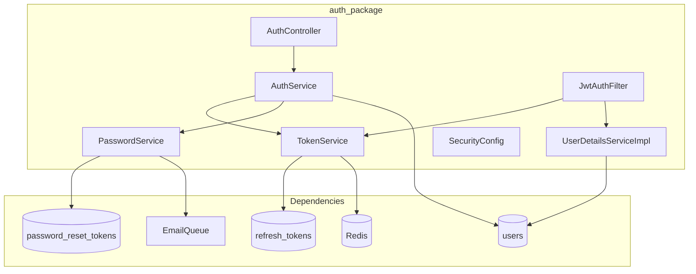
```mermaid
flowchart TB
  subgraph authModule [auth_package]
    AuthController
    AuthService
    TokenService
    PasswordService
    UserDetailsServiceImpl
    JwtAuthFilter
    SecurityConfig
  end

  subgraph deps [Dependencies]
    UserRepo[(users)]
    RefreshTokenRepo[(refresh_tokens)]
    ResetTokenRepo[(password_reset_tokens)]
    Redis[(Redis)]
    MailQueue[EmailQueue]
  end

  AuthController --> AuthService
  AuthService --> TokenService
  AuthService --> PasswordService
  AuthService --> UserRepo
  TokenService --> RefreshTokenRepo
  TokenService --> Redis
  PasswordService --> ResetTokenRepo
  PasswordService --> MailQueue
  JwtAuthFilter --> TokenService
  JwtAuthFilter --> UserDetailsServiceImpl
  UserDetailsServiceImpl --> UserRepo
```


---

### 19.2 Database schema

#### Bảng `users`


| Column           | Type         | Constraints                | Mô tả                |
| ---------------- | ------------ | -------------------------- | -------------------- |
| `id`             | UUID         | PK                         |                      |
| `email`          | VARCHAR(255) | UNIQUE, NOT NULL           | Lowercase normalized |
| `password_hash`  | VARCHAR(255) | NOT NULL                   | BCrypt strength 12   |
| `full_name`      | VARCHAR(100) | NOT NULL                   |                      |
| `phone`          | VARCHAR(20)  | NULL                       | E.164                |
| `status`         | VARCHAR(20)  | NOT NULL, default `active` | `active`             |
| `email_verified` | BOOLEAN      | default false              | MVP: optional verify |
| `created_at`     | TIMESTAMPTZ  | NOT NULL                   |                      |
| `updated_at`     | TIMESTAMPTZ  | NOT NULL                   |                      |
| `last_login_at`  | TIMESTAMPTZ  | NULL                       |                      |


#### Bảng `user_roles` (many-to-many, hoặc `roles TEXT[]` trên users)


| Column    | Type        | Mô tả      |
| --------- | ----------- | ---------- |
| `user_id` | UUID        | FK → users |
| `role`    | VARCHAR(20) | `BUYER`    |


**Quy tắc role:**

- Register → auto gán `BUYER`
- Admin approve seller → thêm `SELLER` (không xóa BUYER)
- `ADMIN` seed bằng migration/SQL, không đăng ký public

#### Bảng `refresh_tokens`


| Column       | Type         | Mô tả                                       |
| ------------ | ------------ | ------------------------------------------- |
| `id`         | UUID         | PK                                          |
| `user_id`    | UUID         | FK                                          |
| `token_hash` | VARCHAR(64)  | SHA-256 của refresh token (không lưu plain) |
| `family_id`  | UUID         | Nhóm rotation — phát hiện token reuse       |
| `expires_at` | TIMESTAMPTZ  | 7 ngày                                      |
| `revoked_at` | TIMESTAMPTZ  | NULL nếu còn hiệu lực                       |
| `created_at` | TIMESTAMPTZ  |                                             |
| `user_agent` | VARCHAR(512) | Optional audit                              |
| `ip_address` | VARCHAR(45)  | Optional audit                              |


#### Bảng `password_reset_tokens`


| Column       | Type        | Mô tả            |
| ------------ | ----------- | ---------------- |
| `id`         | UUID        | PK               |
| `user_id`    | UUID        | FK               |
| `token_hash` | VARCHAR(64) | SHA-256          |
| `expires_at` | TIMESTAMPTZ | 1 giờ            |
| `used_at`    | TIMESTAMPTZ | NULL = chưa dùng |
| `created_at` | TIMESTAMPTZ |                  |


**Index:** `users(email)`, `refresh_tokens(token_hash)`, `password_reset_tokens(token_hash)`

---

### 19.3 Chiến lược JWT

#### Access Token


| Thuộc tính       | Giá trị MVP                                                                           |
| ---------------- | ------------------------------------------------------------------------------------- |
| Algorithm        | HS256 (MVP) hoặc RS256 (prod khuyến nghị)                                             |
| TTL              | **15 phút** (900s)                                                                    |
| Storage (client) | Memory (React state) hoặc sessionStorage — **không** localStorage nếu có XSS risk cao |
| Transport        | `Authorization: Bearer {token}`                                                       |


**JWT Claims (payload):**

```json
{
  "sub": "user-uuid",
  "email": "buyer@example.com",
  "roles": ["BUYER", "SELLER"],
  "iat": 1719648000,
  "exp": 1719648900,
  "jti": "unique-token-id"
}
```

Không nhúng PII nhạy cảm (phone, address) vào JWT.

#### Refresh Token


| Thuộc tính       | Giá trị                                                                                |
| ---------------- | -------------------------------------------------------------------------------------- |
| Format           | Opaque random 256-bit, Base64URL                                                       |
| TTL              | **7 ngày**                                                                             |
| Storage (client) | **httpOnly Secure SameSite=Strict cookie** (khuyến nghị) hoặc body JSON (MVP đơn giản) |
| Rotation         | Mỗi lần refresh → revoke token cũ, cấp token mới cùng `family_id`                      |


#### Refresh Token Rotation + Reuse Detection

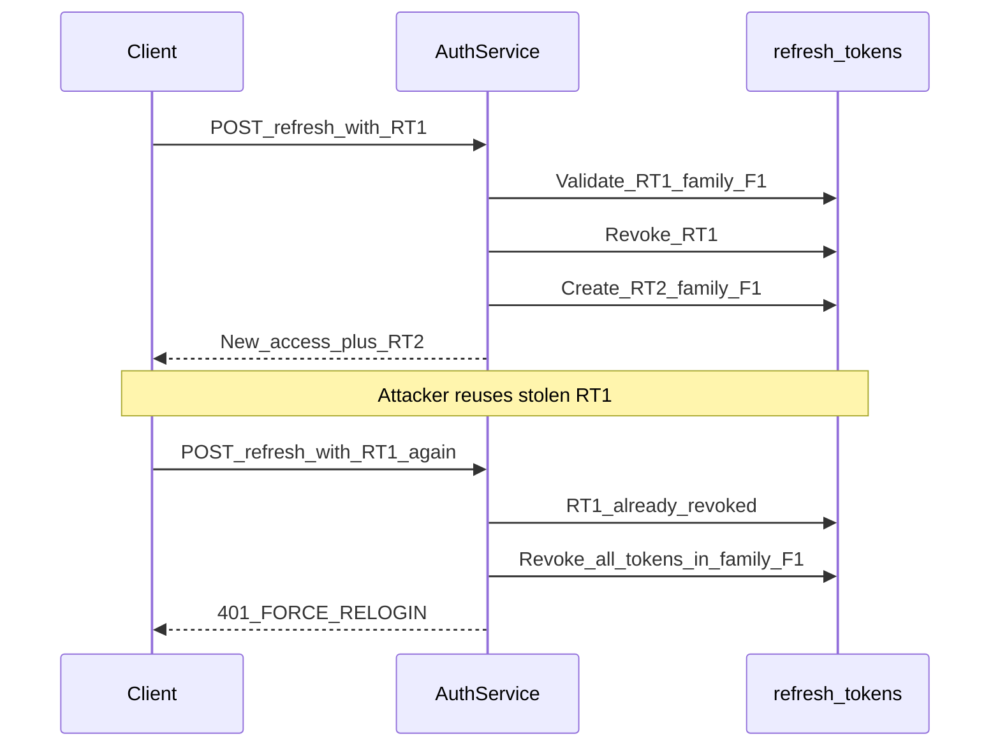
```mermaid
sequenceDiagram
  participant C as Client
  participant API as AuthService
  participant DB as refresh_tokens

  C->>API: POST_refresh_with_RT1
  API->>DB: Validate_RT1_family_F1
  API->>DB: Revoke_RT1
  API->>DB: Create_RT2_family_F1
  API-->>C: New_access_plus_RT2

  Note over C,DB: Attacker reuses stolen RT1
  C->>API: POST_refresh_with_RT1_again
  API->>DB: RT1_already_revoked
  API->>DB: Revoke_all_tokens_in_family_F1
  API-->>C: 401_FORCE_RELOGIN
```


Nếu phát hiện reuse → revoke toàn bộ family → buộc user đăng nhập lại (bảo vệ token theft).

---

### 19.4 RBAC — Role & Permission

#### Ma trận quyền theo role


| Resource / Action    | Guest | BUYER      | SELLER          | ADMIN      |
| -------------------- | ----- | ---------- | --------------- | ---------- |
| Xem catalog public   | Yes   | Yes        | Yes             | Yes        |
| Quản lý giỏ/checkout | —     | Own        | Own             | —          |
| Xem đơn hàng         | —     | Own orders | Own shop groups | All        |
| CRUD sản phẩm        | —     | —          | Own shop        | All (read) |
| Seller application   | —     | Yes        | —               | —          |
| Duyệt seller         | —     | —          | —               | Yes        |
| CRUD categories      | —     | —          | —               | Yes        |
| Audit logs           | —     | —          | —               | Yes        |


#### Spring Security expression mapping

```java
// Ví dụ annotation trên controller
@PreAuthorize("hasRole('BUYER')")           // cart, checkout, orders
@PreAuthorize("hasRole('SELLER')")          // seller/* — + ownership check trong service
@PreAuthorize("hasRole('ADMIN')")           // admin/*
@PreAuthorize("permitAll()")                 // auth/register, catalog public
```

**Ownership check (SELLER):** Auth chỉ verify role; service layer verify `sellerProfile.userId == currentUser.id` hoặc `product.sellerId == currentSeller.id`.

**SELLER chưa approved:** User có role SELLER nhưng `sellerProfile.status != approved` → chặn `POST /seller/products` với `403 SELLER_NOT_APPROVED`.

---

### 19.5 Spring Security — Filter chain

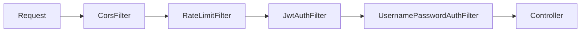
```mermaid
flowchart LR
  Request --> CorsFilter
  CorsFilter --> RateLimitFilter
  RateLimitFilter --> JwtAuthFilter
  JwtAuthFilter --> UsernamePasswordAuthFilter
  UsernamePasswordAuthFilter --> Controller
```


`**SecurityFilterChain` config (MVP):**


| Path pattern                        | Access                             |
| ----------------------------------- | ---------------------------------- |
| `POST /api/v1/auth/register`        | permitAll                          |
| `POST /api/v1/auth/login`           | permitAll                          |
| `POST /api/v1/auth/refresh`         | permitAll                          |
| `POST /api/v1/auth/forgot-password` | permitAll                          |
| `POST /api/v1/auth/reset-password`  | permitAll                          |
| `GET /api/v1/categories/`**         | permitAll                          |
| `GET /api/v1/products/`**           | permitAll                          |
| `GET /api/v1/shops/`**              | permitAll                          |
| `POST /api/v1/webhooks/**`          | permitAll + signature verify riêng |
| `GET /api/v1/cart`                  | permitAll (guest hoặc user)        |
| `POST /api/v1/cart/**`              | permitAll (guest hoặc user)        |
| `/api/v1/seller/**`                 | hasRole SELLER                     |
| `/api/v1/admin/**`                  | hasRole ADMIN                      |
| `/api/v1/**` còn lại                | authenticated                      |


`**JwtAuthFilter` logic:**

1. Đọc `Authorization: Bearer` header
2. Không có token → pass through (endpoint permitAll) hoặc 401 (protected)
3. Parse JWT, verify signature + expiry
4. Load `UserDetails` từ cache/DB
5. Kiểm tra `user.status == active` → không thì 403
6. Set `SecurityContextHolder`

---

### 19.6 Cấu trúc code (Spring Boot)

```
backend/src/main/java/com/marketplace/auth/
  config/
    SecurityConfig.java
    PasswordEncoderConfig.java        # BCryptPasswordEncoder strength 12
  controller/
    AuthController.java
  dto/
    RegisterRequest.java
    LoginRequest.java
    AuthResponse.java
    RefreshRequest.java
    ForgotPasswordRequest.java
    ResetPasswordRequest.java
  entity/
    RefreshToken.java
    PasswordResetToken.java
  repository/
    RefreshTokenRepository.java
    PasswordResetTokenRepository.java
  security/
    JwtAuthFilter.java
    JwtTokenProvider.java
    UserPrincipal.java                # implements UserDetails
    UserDetailsServiceImpl.java
  service/
    AuthService.java
    TokenService.java
    PasswordResetService.java
  exception/
    InvalidCredentialsException.java
    TokenExpiredException.java
    AccountSuspendedException.java
```

`**user/` package (liên quan):**

```
user/
  entity/User.java
  entity/UserRole.java
  repository/UserRepository.java
  service/UserService.java          # findByEmail, createUser
```

---

### 19.7 Luồng chi tiết từng chức năng

#### 19.7.1 Register — UC-BUY-001

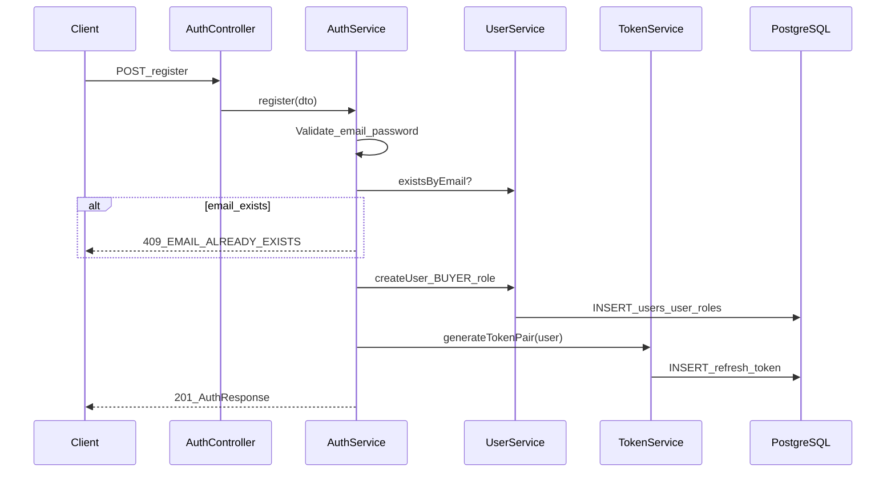
```mermaid
sequenceDiagram
  participant C as Client
  participant AC as AuthController
  participant AS as AuthService
  participant US as UserService
  participant TS as TokenService
  participant DB as PostgreSQL

  C->>AC: POST_register
  AC->>AS: register(dto)
  AS->>AS: Validate_email_password
  AS->>US: existsByEmail?
  alt email_exists
    AS-->>C: 409_EMAIL_ALREADY_EXISTS
  end
  AS->>US: createUser_BUYER_role
  US->>DB: INSERT_users_user_roles
  AS->>TS: generateTokenPair(user)
  TS->>DB: INSERT_refresh_token
  AS-->>C: 201_AuthResponse
```


**Validation rules:**


| Field      | Rule                                     |
| ---------- | ---------------------------------------- |
| `email`    | RFC 5322 format, max 255, lowercase trim |
| `password` | Min 8, max 128, ít nhất 1 chữ + 1 số     |
| `fullName` | 2–100 ký tự, không toàn space            |
| `phone`    | Optional, regex E.164                    |


**Password hashing:** `BCrypt.hashpw(password, BCrypt.gensalt(12))`

---

#### 19.7.2 Login — UC-BUY-002

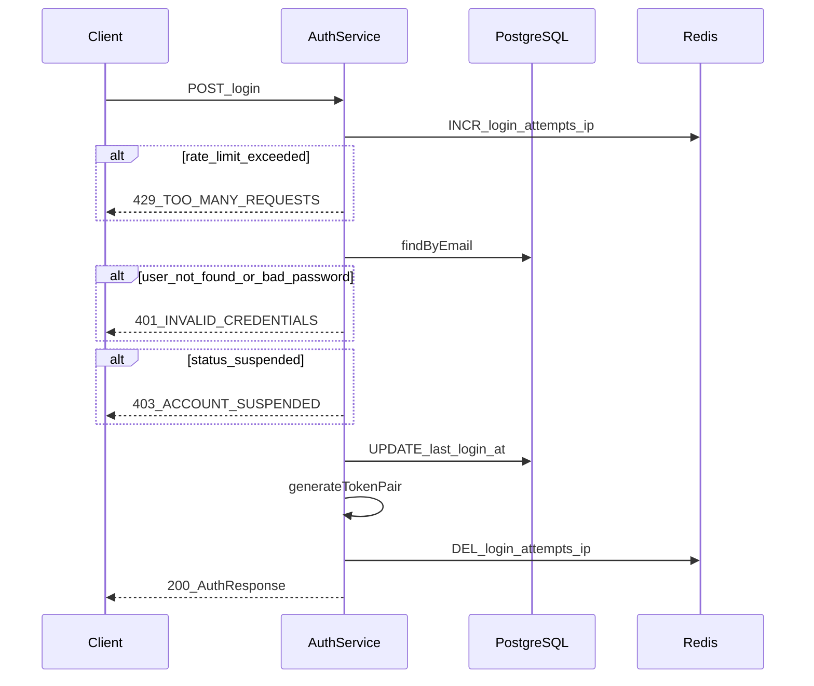
```mermaid
sequenceDiagram
  participant C as Client
  participant AS as AuthService
  participant DB as PostgreSQL
  participant R as Redis

  C->>AS: POST_login
  AS->>R: INCR_login_attempts_ip
  alt rate_limit_exceeded
    AS-->>C: 429_TOO_MANY_REQUESTS
  end
  AS->>DB: findByEmail
  alt user_not_found_or_bad_password
    AS-->>C: 401_INVALID_CREDENTIALS
  end
  alt status_suspended
    AS-->>C: 403_ACCOUNT_SUSPENDED
  end
  AS->>DB: UPDATE_last_login_at
  AS->>AS: generateTokenPair
  AS->>R: DEL_login_attempts_ip
  AS-->>C: 200_AuthResponse
```


**Timing attack mitigation:** Luôn chạy BCrypt compare kể cả khi user không tồn tại (dùng dummy hash).

**Post-login (client):**

1. Lưu `accessToken` (memory/sessionStorage)
2. Lưu `refreshToken` (httpOnly cookie nếu dùng cookie mode)
3. Gọi `POST /cart/merge` nếu có guest session
4. Redirect về trang trước hoặc home

---

#### 19.7.3 Refresh — UC-BUY-002

**Request:** `{ "refreshToken": "..." }` hoặc đọc từ httpOnly cookie

**Steps:**

1. Hash refresh token → lookup DB
2. Kiểm tra `revoked_at IS NULL` và `expires_at > now`
3. Nếu revoked nhưng vẫn gửi lên → **reuse attack** → revoke cả family
4. Revoke token hiện tại
5. Tạo access token mới + refresh token mới (cùng family_id)
6. Trả response

**Response:** `{ accessToken, refreshToken, expiresIn: 900 }`

---

#### 19.7.4 Logout — UC-BUY-002

**Auth:** Bearer access token (optional — vẫn logout được chỉ với refresh)

**Steps:**

1. Hash refresh token từ body/cookie
2. Set `revoked_at = now` trên DB
3. Thêm `jti` access token vào Redis blacklist (TTL = thời gian còn lại của access token) — optional MVP
4. Response `204`

**Logout all devices (P1):** `POST /auth/logout-all` → revoke tất cả refresh tokens của user

---

#### 19.7.5 Forgot Password — UC-BUY-003

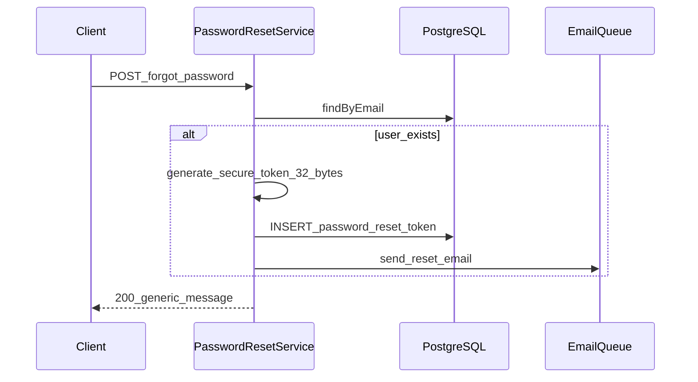
```mermaid
sequenceDiagram
  participant C as Client
  participant AS as PasswordResetService
  participant DB as PostgreSQL
  participant Mail as EmailQueue

  C->>AS: POST_forgot_password
  AS->>DB: findByEmail
  alt user_exists
    AS->>AS: generate_secure_token_32_bytes
    AS->>DB: INSERT_password_reset_token
    AS->>Mail: send_reset_email
  end
  AS-->>C: 200_generic_message
```


**Email link:** `https://buyer.example.com/reset-password?token={plainToken}`

**Token:** 32 bytes random → SHA-256 lưu DB; plain chỉ gửi email, TTL 1 giờ, one-time use.

**Luôn trả 200** dù email không tồn tại — message: `"If the email exists, a reset link has been sent."`

---

#### 19.7.6 Reset Password — UC-BUY-003

**Steps:**

1. Hash token từ request → lookup `password_reset_tokens`
2. Kiểm tra `used_at IS NULL` và `expires_at > now`
3. Validate `newPassword` (cùng rule register)
4. Update `users.password_hash`
5. Set `used_at = now` trên reset token
6. **Revoke tất cả refresh tokens** của user (buộc login lại)
7. Response 200

**Errors:** `400 TOKEN_INVALID`, `400 TOKEN_EXPIRED`, `400 VALIDATION_ERROR`

---

### 19.8 Gán role SELLER (tích hợp cross-module)

Auth không tự gán SELLER khi user apply shop. Luồng:

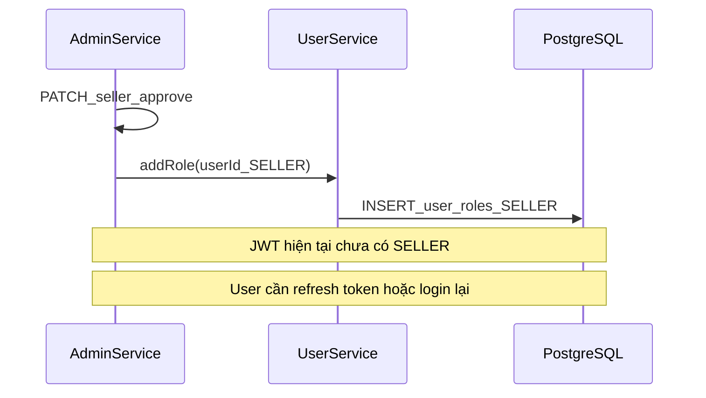
```mermaid
sequenceDiagram
  participant Admin as AdminService
  participant UserSvc as UserService
  participant DB as PostgreSQL

  Admin->>Admin: PATCH_seller_approve
  Admin->>UserSvc: addRole(userId_SELLER)
  UserSvc->>DB: INSERT_user_roles_SELLER
  Note over Admin,DB: JWT hiện tại chưa có SELLER
  Note over Admin,DB: User cần refresh token hoặc login lại
```


**Khuyến nghị:** Sau approve, frontend seller portal prompt "Phiên đăng nhập cần làm mới" → gọi `POST /auth/refresh` hoặc re-login để JWT có role mới.

`AuthService.addRole(UUID userId, Role role)` — public API nội bộ cho `admin/` và `seller/` modules.

---

### 19.9 Redis keys


| Key pattern                   | TTL                      | Mục đích                  |
| ----------------------------- | ------------------------ | ------------------------- |
| `auth:login_attempts:{ip}`    | 15 min                   | Rate limit login, max 10  |
| `auth:register_attempts:{ip}` | 1 hour                   | Max 5 register            |
| `auth:access_blacklist:{jti}` | = access token remaining | Logout instant invalidate |
| `auth:user_roles:{userId}`    | 5 min                    | Cache roles cho JwtFilter |


---

### 19.10 Application properties

```yaml
app:
  auth:
    jwt:
      secret: ${JWT_SECRET}              # min 256-bit, env only
      access-token-expiration: 900       # 15 minutes
      refresh-token-expiration: 604800     # 7 days
      issuer: marketplace-api
    password-reset:
      expiration: 3600                   # 1 hour
    bcrypt-strength: 12
  frontend:
    buyer-url: https://shop.example.com
    reset-password-path: /reset-password
```

---

### 19.11 Mã lỗi Auth (error codes)


| Code                   | HTTP | Mô tả                                |
| ---------------------- | ---- | ------------------------------------ |
| `VALIDATION_ERROR`     | 400  | Bean validation fail                 |
| `INVALID_CREDENTIALS`  | 401  | Sai email/password                   |
| `TOKEN_EXPIRED`        | 401  | Access hoặc refresh hết hạn          |
| `TOKEN_INVALID`        | 401  | JWT malformed / reset token sai      |
| `UNAUTHORIZED`         | 401  | Thiếu token trên protected route     |
| `ACCOUNT_SUSPENDED`    | 403  | User bị suspend                      |
| `FORBIDDEN`            | 403  | Thiếu role                           |
| `EMAIL_ALREADY_EXISTS` | 409  | Email đã đăng ký                     |
| `TOO_MANY_REQUESTS`    | 429  | Rate limit                           |
| `TOKEN_REUSE_DETECTED` | 401  | Refresh token reuse — force re-login |


---

### 19.12 Tích hợp Frontend (React)

#### Auth state (Zustand hoặc React Context)

```typescript
interface AuthState {
  user: User | null;
  accessToken: string | null;
  isAuthenticated: boolean;
  login: (email: string, password: string) => Promise<void>;
  register: (data: RegisterData) => Promise<void>;
  logout: () => Promise<void>;
  refresh: () => Promise<void>;
}
```

#### Axios interceptor pattern

```typescript
// Request: attach Bearer accessToken
api.interceptors.request.use((config) => {
  const token = authStore.getState().accessToken;
  if (token) config.headers.Authorization = `Bearer ${token}`;
  return config;
});

// Response: auto-refresh on 401
api.interceptors.response.use(
  (res) => res,
  async (error) => {
    if (error.response?.status === 401 && !error.config._retry) {
      error.config._retry = true;
      await authStore.getState().refresh();
      return api(error.config);
    }
    return Promise.reject(error);
  }
);
```

#### Protected routes


| App    | Route guard          | Redirect                      |
| ------ | -------------------- | ----------------------------- |
| buyer  | `RequireAuth`        | `/login?returnUrl=`           |
| seller | `RequireRole SELLER` | `/seller/apply` hoặc `/login` |
| admin  | `RequireRole ADMIN`  | `/403`                        |


#### Pages Auth (buyer app)


| Route              | Component          | UC         |
| ------------------ | ------------------ | ---------- |
| `/register`        | RegisterPage       | UC-BUY-001 |
| `/login`           | LoginPage          | UC-BUY-002 |
| `/forgot-password` | ForgotPasswordPage | UC-BUY-003 |
| `/reset-password`  | ResetPasswordPage  | UC-BUY-003 |


---

### 19.13 Bảo mật bổ sung


| Mối đe dọa          | Biện pháp                                          |
| ------------------- | -------------------------------------------------- |
| Brute force login   | Rate limit Redis + exponential delay               |
| Credential stuffing | CAPTCHA sau 5 fail (P1)                            |
| XSS steal token     | httpOnly cookie cho refresh; CSP headers           |
| CSRF                | SameSite=Strict cookie; CSRF token nếu cookie auth |
| JWT theft           | Short TTL 15m + refresh rotation                   |
| Password weak       | Validation + có thể tích hợp zxcvbn (P1)           |
| Email enumeration   | Generic message forgot-password                    |
| Session fixation    | Token mới mỗi login                                |


**Không làm trong MVP:** OAuth2 Google/Facebook, 2FA TOTP, passkey — ghi backlog phase 2.

---

### 19.14 Testing checklist


| Test                              | Loại        | Mô tả                          |
| --------------------------------- | ----------- | ------------------------------ |
| Register happy path               | Integration | 201 + tokens + BUYER role      |
| Register duplicate email          | Integration | 409                            |
| Login valid / invalid             | Integration | 200 / 401                      |
| Login suspended user              | Integration | 403                            |
| Access protected without token    | API         | 401                            |
| Access seller route as BUYER only | API         | 403                            |
| Refresh rotation                  | Integration | Old refresh revoked, new works |
| Refresh reuse detection           | Integration | Family revoked, 401            |
| Logout invalidates refresh        | Integration | Refresh after logout fails     |
| Forgot password sends email       | Integration | Mock mail + token in DB        |
| Reset password revokes sessions   | Integration | Old refresh fails              |
| JWT expiry                        | Unit        | Expired token rejected         |
| Rate limit login                  | Integration | 429 after 10 attempts          |


---

### 19.15 Thứ tự implement (Phase 0)

1. `User` entity + `UserRepository` + Flyway migration
2. `SecurityConfig` + `PasswordEncoder` + permitAll public routes
3. `JwtTokenProvider` + `JwtAuthFilter` + `UserDetailsServiceImpl`
4. `POST /auth/register` + `POST /auth/login`
5. Refresh token entity + `POST /auth/refresh` + rotation
6. `POST /auth/logout`
7. Forgot/reset password + email template
8. Rate limiting filter
9. `addRole()` cho admin approve seller
10. React: login/register pages + axios interceptor + route guards

**Definition of Done — Module Auth:**

- [ ] Register, login, logout, refresh hoạt động
- [ ] JWT bảo vệ đúng routes theo RBAC matrix
- [ ] Refresh token rotation + reuse detection
- [ ] Forgot/reset password end-to-end
- [ ] Rate limit login/register
- [ ] Unit + integration tests pass
- [ ] OpenAPI `auth.yaml` khớp implementation

---

## 20. Module Catalog — Thiết kế chi tiết

Module Catalog quản lý danh mục (admin), sản phẩm/variant/tồn kho/ảnh (seller), và API public cho buyer. Phụ thuộc `seller_profiles` (seller approved) và Auth/RBAC.

> Implementation skeleton: `marketplace/backend/src/main/java/com/marketplace/catalog/`

### 20.1 Phạm vi & ranh giới


| Thuộc Catalog                | Không thuộc Catalog                       |
| ---------------------------- | ----------------------------------------- |
| Category tree (admin CRUD)   | Seller onboarding (`seller/` — phase sau) |
| Product CRUD (seller)        | Cart / checkout                           |
| Variant + inventory baseline | Inventory reservation (cart module)       |
| Image upload                 | Order / payment                           |
| Public listing, search, PDP  | Admin duyệt seller                        |
| Shop public page             | Review / rating                           |


**Use cases:** UC-GST-001/002/003, UC-SEL-003→006, UC-ADM-003/004

### 20.2 Database schema

```mermaid
erDiagram
  SellerProfile ||--o{ Product : lists
  Category ||--o{ Product : contains
  Product ||--o{ ProductVariant : has
  ProductVariant ||--|| Inventory : tracks
  Product ||--o{ ProductImage : has
  Category ||--o{ Category : parent_of
```


| Bảng               | Mô tả                                                       |
| ------------------ | ----------------------------------------------------------- |
| `seller_profiles`  | Shop, slug, status, currency — prerequisite                 |
| `categories`       | Cây danh mục, admin quản lý                                 |
| `products`         | SP của seller, slug global unique, `search_vector` tsvector |
| `product_variants` | SKU, price, attributes JSONB                                |
| `inventory`        | quantity, reserved_qty (cart module dùng sau)               |
| `product_images`   | URL, sort_order                                             |


**Visibility rule (public):** `product.status = ACTIVE` AND `seller.status = APPROVED`

### 20.3 State machine — Product

```mermaid
stateDiagram-v2
  [*] --> draft: seller_create
  draft --> active: seller_publish
  active --> inactive: seller_unpublish
  inactive --> active: seller_republish
  active --> suspended: admin_moderate
  suspended --> active: admin_restore
```


**Publish validation:** >= 1 variant, >= 1 image, seller approved.

### 20.4 API map (đã implement trong skeleton)


| UC         | Method      | Endpoint                                     |
| ---------- | ----------- | -------------------------------------------- |
| UC-GST-001 | GET         | `/categories?parentId&depth`                 |
| UC-GST-002 | GET         | `/products?q&categorySlug&sellerSlug`        |
| UC-GST-003 | GET         | `/products/{slug}`, `/shops/{slug}`          |
| UC-SEL-003 | POST        | `/seller/products`                           |
| UC-SEL-004 | PATCH       | `/seller/products/{id}/status`               |
| UC-SEL-005 | PUT         | `/seller/products/{id}/variants/{variantId}` |
| UC-SEL-006 | POST/DELETE | `/seller/products/{id}/images`               |
| UC-ADM-003 | CRUD        | `/admin/categories`                          |


### 20.5 Package structure

```
catalog/
  config/       MediaResourceConfig
  controller/   Category, Product, Shop, SellerProduct, AdminCategory
  dto/
  entity/
  exception/
  mapper/       CatalogMapper
  repository/
  service/      CategoryService, ProductCatalogService, SellerProductService, ShopService, AdminCategoryService
  storage/      ImageStorageService, LocalImageStorageService
  util/         SlugUtils
seller/
  entity/       SellerProfile, SellerStatus
  repository/
  service/      SellerContextService
  exception/
```

### 20.6 Luồng seller tạo & publish SP

```mermaid
sequenceDiagram
  participant S as Seller
  participant API as SellerProductService
  participant DB as PostgreSQL
  participant Store as ImageStorage

  S->>API: POST_seller_products
  API->>API: requireCurrentSellerProfile_APPROVED
  API->>DB: INSERT_product_draft_variants_inventory
  S->>API: POST_images
  API->>Store: storeProductImage
  S->>API: PATCH_status_active
  API->>API: validate_variants_and_images
  API->>DB: UPDATE_status_ACTIVE
```


### 20.7 Search (MVP)

PostgreSQL `tsvector` + `plainto_tsquery` trên `name`/`description`, fallback `ILIKE`. Phase 2: Elasticsearch.

### 20.8 Image storage


| Môi trường | Backend                                      |
| ---------- | -------------------------------------------- |
| Local dev  | `uploads/` + serve `/media/**`               |
| Production | S3/MinIO — implement `S3ImageStorageService` |


### 20.9 Testing checklist

- Public listing chỉ hiện ACTIVE + seller APPROVED
- Search theo `q`, filter categorySlug/sellerSlug
- Seller không publish được khi thiếu ảnh/variant
- Seller chỉ sửa SP của shop mình (403)
- Admin CRUD category, không xóa category có children
- Slug unique globally cho product

### 20.10 Definition of Done — Module Catalog

- [ ] Flyway V2 + V3 chạy OK
- [ ] Public GET categories, products, shops
- [ ] Seller CRUD products + upload image + publish
- [ ] Admin CRUD categories
- [ ] Compile + manual smoke test